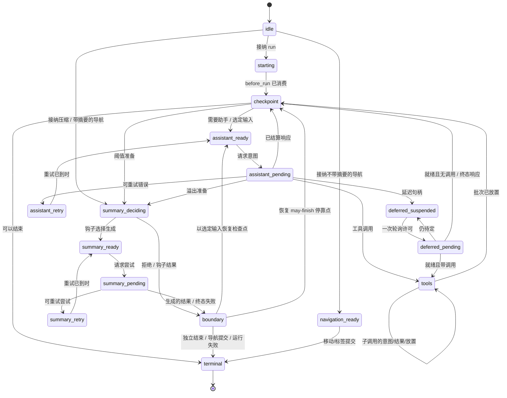

# AgentHarness — 实现规范

> 本文是 [`harness.md`](harness.md) 的中文译本。英文原文是规范性规格；二者若有出入，以英文原文为准。代码标识符、类型名、状态名、API 名称与 `TX[...]` 记法保持英文。章节编号（§N.M）与原文一致。

各节按 §N.M 编号，便于交叉引用。分部分目录：

- [第 0 部分 — 导读](#part-0--orientation)：系统模型 · 三个存储 · 演算示例 · 非目标 · 记法与源类型 · 校验边界 · 实现状态
- [第 1 部分 — 存储](#part-1--storage)：模型 · 身份 · 绑定值与列表 · 事务 · 查询 · 用量账本 · 后端 · 理由
- [第 2 部分 — 对话树](#part-2--the-conversation-tree)：条目 · 放置 · Branch 与 AgentLane · 元数据 · 分支查询与上下文 · 分支索引 · 分叉 · Session 与仓库（含 C1、搜索） · 精确重写
- [第 3 部分 — 操作状态机](#part-3--the-operation-state-machine)：操作 · 状态 · 通道状态 · 转移规则 · 图 · 接纳 · 助手 · 工具 · 摘要 · 导航 · 收件箱 · 边界 · 终态结果
- [第 4 部分 — 执行、恢复、中止、关闭](#part-4--execution-recovery-abort-close)：Drive · 效应门 · 变更线 · 附着 · 恢复 · 中止 · 关闭 · 故障
- [第 5 部分 — 公开表面](#part-5--public-surface)：通道 · harness · Session 与 Branch · 快照 · 事件 · 钩子 · 执行块 · 遥测
- [第 6 部分 — 未来：分区保留（Postgres）](#part-6--future-partitioned-retention-postgres)
- [第 7 部分 — 模式演进](#part-7--schema-evolution)
- [第 8 部分 — 工作包](#part-8--work-packages)
- [第 9 部分 — 不变量与测试](#part-9--invariants-and-tests)：38 条不变量 · 竞态目录 · 测试分层
- [附录 A — 术语表](#appendix-a--glossary) · [附录 B — coding-agent v3 格式兼容](#appendix-b--coding-agent-v3-format-compatibility) · [附录 C — 未决问题](#appendix-c--open-questions)

<a id="part-0--orientation"></a>

# 第 0 部分 — 导读

## 0.1 这是什么

面向智能体对话的持久运行时：它把对话与操作状态落盘，使中断的工作能够恢复，且不重复已经结算的效应。本文是规范性规格；§0.9 标出已规定但尚未实现的部分。公开类型声明位于 §0.7 点名的源文件中——本文只在形状本身构成规则时复述声明。

## 0.2 系统模型

一个**会话**有四部分：不可变的**条目树**（消息、压缩、分支摘要，或应用自定义条目；各分支共享同一棵树，从而在保留历史的同时支持分支、压缩、分叉与并行工作）；位于绑定带类型地址上的可变**值与列表**（内建：会话名、条目标签；应用自定义抗冲突地址）；**Branch 与 AgentLane**（Branch 是一条具名数据路径，带可移动的 tip；AgentLane 在其上增加完备的模型配置、队列，以及至多一个操作；会话可以两者皆无地启动，`main` 只是一个普通的显式名字）；以及只追加的**用量账本**。

Session 层拥有全局持久数据与 Branch 能力。**harness** 用四个原语驱动通道：`accept` 持久地创建一个操作，`drive` 推进一个预期操作，`requestAbort` 持久地请求取消，`inspectExecution` 原子地报告当前执行与最近一次终态执行；另有便捷方法（`prompt`、`resume`、`abort` 等）把它们与进程本地的等待策略组合起来。服务层也可以改由闹钟、作业或其他宿主运行时调度 `drive`。harness 还拥有全 harness 范围的工具与提示资源注册表、钩子、被动事件和运行时配置。

一个**操作**是通道上一个已被接纳的工作单元：运行、压缩或导航。不可变元数据记录身份、意图与起点；一份完备的当前状态记录阶段、控制与恢复数据；排队输入属于通道。接纳与执行所有权分离：已接纳的操作可以没有进程本地的驱动者。完成时删除操作拥有的状态，并写入一条不可变结果记录。

**Context。** 每一个异步的公开 harness / 通道 / Session / Branch / 仓库 / 存储方法都接受一个显式的尾随 `Context`；同步注册（`events.on()`、`hooks.on()`）不带 Context，处理函数在被调用时才收到 Context。Context 存在，是因为并发调用需要独立的遥测父级，并且 RPC 适配器必须把一次请求的取消携带为 `context.abortSignal`。共享接收者从不保留调用方 Context，也不通过 `AsyncLocalStorage` 发现 Context。按请求 ID 的 RPC 取消已经实现：客户端把信号映射为 `cancel(requestId)`，服务端派生一个带 `AbortController` 的请求 Context，在匹配的取消或断开时中止。追踪注入 / 提取以及远程遥测父级重建已规定但未实现（T1，§5.8）。Context 是进程本地的调用权威，绝不是持久数据：中止它不会调用 `requestAbort()`，也不会写入 `cancel_requested`。

**存储**（第 1 部分）在三种持久形态上提供原子事务与查询。`pi.op.meta` 每个操作写一次；`pi.op.state` 在每次转移后被替换为完整的当前状态；有界进度的工具检查点是辅助数据，永远不能证明效应已完成。终态事务删除操作拥有的值 / 列表，并写入不可变的 `pi.result/{operationId}`。任何部分事务都不可见。

## 0.3 三个存储

第 1–5 部分的一切都从四条规则推出。

**1. 三个存储，一条不变量。**

```text
entries        对话树 — 一次写入，只追加
values/lists   当前可变状态 — 可替换的值；只追加的列表
               （追加，或整表删除）
usage ledger   成本历史 — 只追加的行
```

*每份载荷都在条目、绑定值 / 列表或账本之中；没有第三处。* 一条条目就是完整的对话记录：放置与载荷在同一行。`Value<T>` 只保存当前值；`ValueList<T>` 保存按写入序号排序的不可变元素，只能整表删除。在进入树之前就已持久存在的完整内容——排队输入、延迟写入、已定稿的乱序工具结果——等待在 `pi.pending.entry` 中，并在放置它的那次事务里变成条目；工具进度只在其效应仍不确定时占用 `pi.pending.tool_output`；流式助手帧只在其响应处于效应待定（effect-pending）时占用 `pi.pending.assistant_frame`（§3.7）。按后端的投影（分支索引、搜索、统计）可重建，且不携带权威。

**2. 原子事务**（§1.4）：条目 / 用量插入与值 / 列表写入以全有或全无方式提交，序号严格递增；事务内部不存在崩溃状态；这是唯一的写原语。

**3. 持久重启点**（§3.2）：每次持久转移之后，harness 用*完整、完备*的当前状态替换 `operationState(operationId)`——从不依赖上一份状态。任务丢失后，恢复读取它，并从负责的过程开始，绝不重放日志，也不从“缺了什么”推断位置。较小的捕获值内联存放；较大的稳定载荷放在同级的操作拥有地址上，或由 id 指名；终态事务删除它们，只留下对话、账本，以及少量通道 / 会话值。

**4. 意图与结算**（§0.4 的轨迹，§3.7–§3.8）：提供方请求与真实工具调用包在两次提交之间——意图（“即将做 X；输出将使用 id R 与 U”）、不确定的效应，然后是结算（完整输出 + 下一状态，工具还要按源序物化）。钩子遵循的是重放契约：钩子结果在消费它的那次事务里变为持久，该事务之前的崩溃可以重跑钩子。因此每个外部效应都可能在没有持久结算的情况下发生；在重放策略依赖这一点时，意图把它显式化，幂等钩子则把它接受为非目标。

## 0.4 演算示例 — 一条 Slack 线程

用户在一个已有 400 条历史的频道里发帖；应用创建一个锚定在该频道 tip 的通道，并调用 `lane.prompt(...)`。规范性写入顺序（每个 `TX[...]` 是一次原子提交）：接纳不跑钩子，也不启动任务或效应；意图在任何内容发出之前铸造响应 / 用量 id；流式事件追加紧凑帧，且不阻塞流（§3.7）；结算把响应、用量、下一状态与帧列表删除一起提交；工具调用遵循意图 → 效应 → 结果结算，并按助手源序物化；终态事务删除操作的值 / 列表并写入 `pi.result/O`：

```text
TX[ insert entry n1 (user msg), upsert pi.branch.tip = n1,
    upsert pi.op.meta/O, upsert pi.op.state/O = starting,
    upsert pi.lane.state = { currentOperationId: O } ]
… first drive owns real work; before_drive then before_run …
TX[ insert injected messages if any, upsert pi.branch.tip when needed,
    upsert pi.op.state/O = checkpoint need_assistant ]
TX[ upsert pi.op.state/O = assistant ready (config snapshot) ]
TX[ upsert pi.op.state/O = effect_pending (reserves response n2, usage u1) ]
… provider streams …                                  ← the uncertain window
TX[ append pi.pending.assistant_frame/O:n2 += frame ]    ← zero or one per non-terminal
                                                        event, enqueued without awaiting
TX[ insert entry n2, insert usage u1, upsert pi.branch.tip = n2,
    delete list pi.pending.assistant_frame/O:n2,
    upsert pi.op.state/O = tools (result id n3 reserved) ]
TX[ upsert pi.op.tool_args/O:s1:0, upsert pi.op.state/O = call 0 effect_pending ]
… tool runs; selected bounded updates may replace pi.pending.tool_output/O:n3 …
TX[ upsert pi.pending.entry/n3 = finalized tool result,
    delete pi.pending.tool_output/O:n3, upsert pi.op.state/O = call 0 outcome_ready ]
TX[ insert entry n3, delete pi.pending.entry/n3, upsert pi.branch.tip = n3,
    upsert pi.op.state/O = checkpoint ]
… second turn: ready · intent · stream · settle (n4, u2) …
TX[ delete pi.op.meta/O, pi.op.state/O, pi.op.tool_args/O:*,
    set pi.result/O = { operationId: O, kind: "run", status: "completed",
                        fromTipId, tipId: n4, startedAt, endedAt },
    upsert pi.lane.state = { currentOperationId: null,
                             lastOperationId: O, inbox: [] } ]
```

在任意两次事务之间杀掉进程再重启：harness 读取该通道必需的值，看哪一次提交是最后一次，然后继续。在提供方流期间死亡，会留下一个可能已被计费、也可能尚未产生输出的请求——这是唯一真正不确定的窗口；§4.5 陈述策略，已提交的帧前缀为合成结算与重连展示保留最新的持久部分，但不能证明请求如何结束。同一频道里的第二条线程在同一份共享历史上运行自己的通道，无需协调。

## 0.5 演算示例 — 工具执行中途崩溃

模型对 `lane.prompt("delete the stale migrations and run the test suite")` 返回两次工具调用。harness 提交批计划，然后提交调用 0 的意图，带上精确参数与 `replay: "never"`。工具删除文件，每 100 ms 发出有界进度，每两秒请求一次持久检查点。进程在一次检查点提交之后死亡：

```text
TX[ insert entry n2 (assistant, 2 calls), insert usage u1, upsert pi.branch.tip = n2,
    upsert pi.op.state/O = tools (result ids n3, n4 reserved) ]
TX[ upsert pi.op.tool_args/O:s1:0, upsert pi.op.state/O = call 0 effect_pending,
                                                    replay: "never" ]
… tool deletes files; live updates u1 … u19 …
TX[ upsert pi.pending.tool_output/O:n3 = bounded update u1 ]
… live updates u2 … u19 …  ← CRASH
```

重启时，`pi.op.state` 写着 `calls[0].status = "effect_pending", replay = "never"`，因此删除不会重跑。后续的 drive 按 §4.5 调和这个孤儿：最新的持久检查点内容加上一条明确的中断警告，在预留 id 下暂存为合成错误，然后正常物化：

```text
TX[ upsert pi.pending.entry/n3 = synthetic interrupted result containing u1,
    delete pi.pending.tool_output/O:n3, upsert pi.op.state/O = call 0 outcome_ready ]
TX[ insert entry n3, delete pi.pending.entry/n3, upsert pi.branch.tip = n3,
    upsert pi.op.state/O = call 0 completed ]
```

每次工具调用都有结果，且没有任何东西跑了两次；若没有已提交的检查点，结果里只有那条警告。若工具声明了 `replay: "safe"`（一次读取、一次查询），harness 会改用已持久的参数重新执行它。

## 0.6 非目标

- **外部效应的恰好一次** — 带副作用的钩子必须幂等，以操作 id 为键。
- **提供方流的续传** — harness 从不重新挂上提供方流；已提交的帧（§3.7）为恢复与重连展示保留最新的持久部分，已结算的响应在任何分类之前就*完整*持久化。
- **多个可写所有者** — 同一时刻恰好有一个宿主分配的所有者可以持有可写 Session；通常该所有者是它的 Session worker，而服务器可以在移交之前临时拥有新建或分叉的目的地。存储后端不强制这条宿主生命周期规则。只读仓库工作（例如 SQLite 源快照）可以与 worker 重叠（§1.7，§2.7）。通道覆盖的是看起来像多写者的工作负载。
- **工作调度** — harness 从不创建平台闹钟、扫描仓库寻找被遗弃的会话、租约托管提交，或承诺 HTTP 回执；它通过 `drive` 报告持久等待，由服务层决定何时再次调用。
- **复制** — 一个会话只活在一处。
- **持久写历史** — 值只保留当前状态，列表只保留到整表删除；没有 API 或表暴露被替换的值或已删除的元素。测试里的写入顺序断言使用包在 `commit()` 外的插桩装饰器（第 9 部分）；生产审计属于遥测（§5.8）。
- **把删除当作运行时特性** — 条目与用量行永不删除：压缩改变的是提供方上下文，不是存储；终态清理只删除值 / 列表；`retainedTail` 把旧消息向前复制，摘要派生自旧内容，因此压缩不是擦除。合规级擦除是管理性的精确重写（§2.9），也是唯一被认可的例外。

## 0.7 记法与源类型

- `TX[ a, b, c ]` — 一次原子提交，写入按该顺序。写入词汇：`insert entry`、`insert usage`、`setValue`、`deleteValue`、`appendList`、`deleteList`。轨迹可以把绑定地址缩写成其持久化的 `namespace/key`；这绝不是 API 签名或第二个 key 参数（§1.3）。
- Id 是 UUIDv7（§1.2），缩写为 `e_*` / `u_*` / `op_*`；时间前缀有意义时，示例会把它展示出来。
- `S(next)` 用下一份完备状态覆盖 `operationState(operationId)`；`L(next)` 对 `laneState(lane)` 做同样的事。
- 声明式规则、转移 / 竞态表、不变量，以及明确称为规范性的轨迹是规范性的；示例以及标为说明性的章节不是。**必须 / 不得**强调义务，但不是唯一的规范性措辞。这澄清了旧的简写：测试所消费的表是契约的一部分。

路径约定：`src/...` 相对于 `packages/agent/`；裸的 harness 路径如 `session/types.ts` 或 `agent-harness.ts` 相对于 `packages/agent/src/harness/`；`docs/...` 相对于 `packages/agent/`；以 `packages/` 开头的路径相对于仓库根。源类型出处：`AgentMessage`、`AgentTool`、`AgentToolResult`、`QueueMode`、`ThinkingLevel` — `packages/agent/src/types.ts`。`Skill`、`PromptTemplate`、`AgentHarnessResources`（下文的 `Resources`）、`AgentHarnessTool*` 一族、`AgentHarnessStreamOptions` / `Patch` — `packages/agent/src/harness/types.ts`。`Model`、`Models`、`Tool`、`Usage`、`RetryPolicy`、`StopReason`、`AssistantMessage`、`ImageContent`、提供方消息、流选项、延迟句柄 — `packages/ai`；`AiContext` 是 pi-ai 提供方请求 `Context` 的别名，用来与 harness 调用 `Context` 区分。`AssistantMessageFrame`、`AssistantMessageFrameEncoder`、`reduceAssistantMessageFrames` — `packages/ai` 的 `src/utils/assistant-message-frame.ts`；harness 不定义第二套帧编解码器或归约器。`CompactionSettings`、`CompactionPreparation`、`CompactResult`、`BranchPreparation`、`BranchSummaryResult` — `packages/agent/src/harness/compaction/`；现有的准备与拆分回合算法仍是实现，除非本文改变它们。`TelemetryContext` 与模式辅助 — `packages/telemetry`；agent 拥有的模式 — `src/harness/telemetry.ts`。`Context`、`ContextKey`、`BACKGROUND_CONTEXT`、派生辅助 — `src/harness/context.ts`。Harness / 通道公开声明 — `src/harness/agent-harness.ts`；Session / 存储声明 — `src/harness/session/types.ts` 与 `session/values.ts`。

公开的 `QueueMode` 是 `"all" | "one-at-a-time"`。公开的 `RetryPolicy` 是 `{ enabled, maxRetries, baseDelayMs, maxAgentDelayMs? }`；操作状态存储规范化后的 `{ maxAttempts, baseDelayMs, maxAgentDelayMs }`。`maxRetries`、`baseDelayMs` 以及可选的 `maxAgentDelayMs` 必须是有限、非负的安全整数，且 `maxRetries + 1` 必须仍安全；禁用重试规范化为一次尝试；省略 `maxAgentDelayMs` 时默认为 60 秒；延迟与 `notBefore` 的算术在 `Number.MAX_SAFE_INTEGER` 处饱和。公开的 `CompactionSettings` 是 `{ enabled, reserveTokens, keepRecentTokens }`；两个 token 计数都必须是有限、非负的安全整数。构造器与 setter 在发布之前拒绝无效设置。`AgentHarnessStreamOptions` 及其补丁包含 `deferred?: boolean | { window?: "15m" | "1h" | "24h" }`；结构性请求始终把它强制为 false。`SettledAssistantMessage` 是 `AssistantMessage & { stopReason: Exclude<StopReason, "pending"> }`。提供方分发在请求时通过 `Models` 解析持久的 `{ provider, modelId }` 身份（同时应用认证）；注册表项缺失或被换掉时，请求在带内失败，如同未知工具。

## 0.8 校验边界

内部 pi 对象是受信任的带类型值：Session、存储、操作过程以及进程内扩展既不在运行时校验形状，也不做防御性克隆。存储仍然强制其操作不变量（原子性、序号分配、唯一 id、父级存在）；后端按需序列化 / 解析；外部编辑或形状损坏的存储不受支持。运行时模式校验属于不可信的线路边界——未来的协议模式切片为可序列化的 pi-ai / harness 数据定义共享的 TypeBox 模式，并从中派生 TypeScript 类型，而不给内部路径增加校验。附着只校验发布小型通道 / 操作投影所需的关系（§3.3，§4.4）；细节上由状态指向的引用是消费时检查（`watch` 验证其快照所需的 pending / 条目判别式与消息角色关系；drive 验证转移输入），可选的助手帧列表与工具检查点可以缺席。

## 0.9 实现状态

WP00–WP07 已完成（第 8 部分）：操作图、公开通道运行时，以及 SQLite 宿主所有权对齐均已实现。第 9 部分陈述所要求的符合性矩阵；它并不声称每一行列出的项都已有一条专门测试。已知缺失行为与当前契约债务，各自在其章节再次标注：

- **J1 — JSONL 快照压缩（§1.7）：** 已规定，未实现；今天死字节永不回收。
- **C1 — 原始 RemoteSession（§2.8）：** 所规定的远程变更传输与已交付的进程本地产品矛盾；实现任一方向之前都需要一个决定。
- **R12 — `watchSession`（§5.2）：** 公开方法抛出 `SliceNotImplemented`；这是唯一被桩掉的 Harness 方法。
- **T1 — 遥测（§5.8）：** span 词汇已声明；生产只启动工具钩子 span。RPC 入口有请求 ID 取消，但没有追踪传播。
- **S3 — 搜索（§2.8）：** 仅设计；当前 `src/search/index.ts` 骨架与之冲突，且没有实现。
- **R11 — 模式迁移（第 7 部分）：** 机制已规定；激活门控；不存在也不需要任何迁移。
- **WP08 — 具名分支与流式分叉（§2.7）：** Slice A 进行中。显式范围与具名分支选择、谱系校验、已配置通道的强制，以及封闭的标量分叉策略已实现。列表、序号 / 高水位保留、直接的 Memory 构造，以及有界的 JSONL / SQLite 传输仍待完成。
- **SQLite 分支发散（§2.6）：** 当前以压缩为界的算法在未压缩分支上可能复制 O(历史)，与其有界前缀目标相反。
- **H1 — 契约 / 测试收口：** 公开的 `OperationStatus` 包含 `"running"`，但当前观察只产生 `"open"` / `"aborting"`（§5.4）；重写前的中止契约在解析 / 发信号之前绑定 `operation_abort`，但当前代码先发信号，并在释放变更线之前绑定接收者（§4.6）；第 9 部分仍是所要求的符合性矩阵，并不声称每一行都有专门测试。
- **源声明更正：** `CommitResult.stats` 与 `SessionReader.getStats()` 已实现；旧的内联声明省略了它们，尽管其他旧章节依赖提交后的总量（§1.4，§2.8）。旧的执行块声明也早于当前源形状：独立的 `streamHarnessAssistant` 允许缺席 `afterResponse`，而持久 Harness 调用方始终提供它；工具阶段直接携带 `AgentHarnessTool`、`toolContext` 与调用能力，并在立即的原始结果之后创建规范结果消息（§5.7）。这些是源形状更正，不是持久边界的变更。
- **门关闭的类型（§4.2）：** 生产契约只允许 `HarnessClosed | HarnessFault`；源目前把私有原语放宽为 `Error`，隔离测试使用这个放宽。生产调用遵守更窄的规则；收窄源类型仍是 H1 清理。
- **精确重写（§2.9）** 与 **分区 Postgres（第 6 部分）：** 管理性 / 未来；没有实现。

存储格式 4 仍是 WIP（稳定化之前）：形状可以就地改变而无需迁移；不要为它们发明迁移义务。详细的未来工作清单见 [`post-wp05-roadmap.md`](post-wp05-roadmap.md)。

---

<a id="part-1--storage"></a>

# 第 1 部分 — 存储

存储对智能体、通道或对话一无所知。它存储条目与用量行，更新绑定的值 / 列表，并回答一小套固定查询。第 2–4 部分完全建立在这之上。

## 1.1 模型

声明：`session/types.ts`、`session/values.ts`。语义：

```ts
type JsonValue = null | boolean | number | string | JsonValue[] | { [k: string]: JsonValue };

/** 一次写入的完整对话记录：放置与载荷在同一行。
    恰好在一次事务中创建，永不修改或删除。具体条目类型：§2.1。 */
interface EntryBase {
  id: string;                // UUIDv7（§1.2）
  parentId: string | null;
  seq: number;               // 提交时由存储分配
  timestamp: number;         // Unix 毫秒，提交时由存储分配
  type: "message" | "compaction" | "branch_summary" | "custom";
  customType?: string;       // 当 type === "custom"
}

/** 唯一的可变存储，由绑定的带类型地址寻址。 */
function value<T>(namespace: string, key = ""): Value<T>;      // kind: "value"
function list<T>(namespace: string, key = ""): ValueList<T>;   // kind: "list"
interface StoredValue<T> { address: Value<T>; value: T; seq: number }  // 最近一次 set 的 seq
interface ListElement<T> { seq: number; value: T }             // 该次追加的全局写入 seq

/** 只追加的成本账本行。永不修改，永不删除（§1.6）。 */
interface UsageRow {
  id: string;                // UUIDv7（§1.2）
  seq: number;
  usage: Usage;
  entryId?: string;          // 该成本所属的条目，若存在
  adjustment: boolean;       // true = 调用方提供的对账，不是提供方报告
  details?: JsonValue;
}
```

## 1.2 身份

每个 id——操作、条目、用量、每一个预留 id——都是来自该会话 id 生成器的 **UUIDv7**（§2.8）；遗留导入会重新铸造以符合（附录 B）。`accept` 可以收到调用方提供的操作 id，使一次持久的宿主提交与 harness 操作共享同一身份；调用方必须按同一契约铸造它，且永不复用。省略则在内部铸造。前 48 位是铸造时间，因此每个引用都自描述且可按时间排序；接受的代价是 id 泄漏创建时间。（第 6 部分说明性的 Postgres 草图建立在这个前缀上。）

铸造规则：（1）id 在其提交操作开始时用 `now()` 铸造——直接追加在同一事务中放置；助手 / 工具 id 落后于放置的时间至多为请求时长；（2）**工具结果 id 继承其助手 id 的时间戳**（`idGenerator.next(timestampMs?)`，新鲜的随机尾），因此一次调用及其结果组即使跨过午夜，在 id 序下仍时间凝聚；（3）合成结算写在已经预留的 id 之下（§4.5）——没有特殊情况。

**不透明载荷**——自定义条目的 `data`、应用值、`details`、消息文本——可以嵌入条目 id；harness 从不跟踪这些引用，它们可能过期。复制内容，不要引用它。

**绝对规则。** 在一个会话内，条目与用量行永不删除——精确重写（§2.9）是唯一例外。缺失的父级始终是损坏。

## 1.3 绑定的值与列表

公开的存储抽象是一个**绑定的带类型地址**：`value<T>(namespace, key?)` 命名一个可替换的持久值，`list<T>(namespace, key?)` 命名一个只追加的持久 `T` 列表。命名空间与键绑定一次；之后每次读或写只收到该地址。没有全局值类型映射、令牌目录、声明合并，或单独的应用状态存储机制。内建构造器位于 `session/values.ts`，直接导入——没有运行时目录或依赖注入包；核心与应用使用同一套通用构造器。

规则：

- `namespace` 必须非空；两个分量都不得包含 `\u0000`。
- 命名空间 `pi` 以及每一个 `pi.*` 命名空间按契约保留给内建；每个内建命名空间都以 `pi.` 开头。应用使用 `pi.*` 是受信任编程缺陷；构造器不做所有权检查——精确的构造器测试强制该约定，而不是运行时特权检查。
- 空键合法，寻址一个会话范围的值或列表。
- 对象身份没有持久含义；相等的 `(kind, namespace, key)` 三元组命名同一位置。
- 用不相容的 TypeScript 类型构造同一位置是受信任编程缺陷。在一个存储版本中，值地址与列表地址不得共享同一个 `(namespace, key)`；存储不做跨种类碰撞检查。
- 改变命名空间、键语法、种类或不相容的值形状需要迁移（第 7 部分）。地址构造之后，后续操作永不接受另一个键。

完整的内建清单：

| 地址构造器 | 种类 | 持久化的命名空间、键 | 值 | 含义 |
| --- | --- | --- | --- | --- |
| `branchTip(lane)` | value | `pi.branch.tip`，lane | 条目 id 或 `null` | 该通道下次追加的位置 |
| `laneConfig(lane)` | value | `pi.lane.config`，lane | `LaneConfiguration` | 完备的通道配置 |
| `laneState(lane)` | value | `pi.lane.state`，lane | `LaneState`（§3.3） | 当前 / 最近操作 id 与收件箱 |
| `operationResult(opId)` | value | `pi.result`，操作 id | `OperationResultRecord`（§3.13） | 不可变的终态观察 |
| `operationMeta(opId)` | value | `pi.op.meta`，操作 id | `OperationMeta`（§3.1） | 接纳数据；写一次 |
| `operationState(opId)` | value | `pi.op.state`，操作 id | `OperationState`（§3.2） | 完备的持久重启点 |
| `operationToolArgs(opId, stepId, sourceIndex)` | value | `pi.op.tool_args`，`{opId}:{stepId}:{sourceIndex}` | 有效参数 | 放行时写一次 |
| `operationToolMemo(opId, invocationId, name)` | value | `pi.op.tool_memo`，`{opId}:{invocationId}:{name}` | `JsonValue` | 调用范围的持久备忘 |
| `operationPreparation(opId, taskId)` | value | `pi.op.preparation`，`{opId}:{taskId}` | `DurableStructuralPreparation` | 结构性准备 |
| `pendingEntry(entryId)` | value | `pi.pending.entry`，预留条目 id | `PendingEntry` | 等待放置的完整内容 |
| `pendingToolOutput(opId, invocationId)` | value | `pi.pending.tool_output`，`{opId}:{invocationId}` | `AgentToolResult<unknown>` | 最新的有界进度检查点 |
| `pendingAssistantFrames(opId, responseEntryId)` | list | `pi.pending.assistant_frame`，`{opId}:{responseEntryId}` | `AssistantMessageFrame` 元素 | 已提交的流帧前缀 |
| `sessionName` | value | `pi.session.name`，空键 | string | 会话名 |
| `entryLabel(entryId)` | value | `pi.entry.label`，条目 id | string | 条目标签 |

恰好五个导出的扫描前缀构造器封装通道清单与操作清理的语法。它们的结果只在作为命名空间范围的 `scanValues()` 输入时有效，绝不是精确的 get / set / delete 地址：

| 前缀构造器 | 命名空间 | 前缀键 |
| --- | --- | --- |
| `branchTipInventoryPrefix()` | `pi.branch.tip` | `""`（所有通道） |
| `operationToolArgsPrefix(opId, stepId?)` | `pi.op.tool_args` | `{opId}:` 或 `{opId}:{stepId}:` |
| `operationToolMemoPrefix(opId, invocationId?)` | `pi.op.tool_memo` | `{opId}:` 或 `{opId}:{invocationId}:` |
| `operationPreparationPrefix(opId)` | `pi.op.preparation` | `{opId}:` |
| `pendingToolOutputPrefix(opId)` | `pi.pending.tool_output` | `{opId}:` |

```ts
/** 尚未放置的内容：当前可变状态，直到放置事务
    写入完整条目并删除该值（§2.2）。 */
type PendingEntry =
  | { type: "message"; payload: AgentMessage }
  | { type: "custom"; customType: string; payload?: JsonValue };
    // 缺席的自定义载荷 = 一条没有 data 的自定义条目
```

`DurableStructuralPreparation`（`session/types.ts`）是一个两变体联合：`kind: "compaction"`，带 `messagesToSummarize`、`turnPrefixMessages`、`retainedTail`、`isSplitTurn`、`tokensBefore`、可选的 `previousSummary`、`fileOps`、`settings`；以及 `kind: "branch_summary"`，带 `messages`、`fileOps`、`totalTokens`。`fileOps` 是 `{ read, written, edited: string[] }`。

生命周期：

```text
pi.lane.*  pi.session.*  pi.entry.*   会话寿命的语义值
pi.result                             不可变的通道寿命记录，每个终态操作一条
pi.op.*                               操作寿命；不晚于终态事务删除（§3.13）
pi.pending.entry                      直到放置、取消或所属操作清理
pi.pending.tool_output                仅在其调用处于 effect-pending 时
pi.pending.assistant_frame            仅在其响应处于 effect-pending 时
```

- `pi.op.meta` 与 `pi.op.preparation` 恰好写一次；`pi.op.tool_args` 每次调用写一次。调用备忘在该调用到达 `outcome_ready` 时死亡。每一个 `pi.op.*` 值都不晚于终态事务删除。
- 通道收件箱及其待放置载荷比操作活得更久，只在被消费或取消时死亡；操作拥有的已暂存工具结果在放置或终态清理时死亡（§3.11）。
- 工具输出是可选的辅助状态：结果暂存原子地删除它；安全重放在重新执行之前删除它；不安全恢复可以把它消费进一个中断结果。
- 助手帧是按全局写入 `seq` 排序的辅助列表元素。缺失的列表是合法的。帧永远不能证明请求已被准入、完成或失败，也永不选择重启点；结算原子地删除那条精确绑定的列表（§3.7）。
- `pi.result` 记录由终态事务写一次，运行时永不更新或删除，恢复也永不读取。
- 删除一个绑定值就是移除它；在地址类型允许的地方，JSON `null` 与缺席保持区分。

## 1.4 事务

一个 `Write` 是六种操作之一的擦除后存储记录——条目插入、用量插入、值设置 / 删除、列表追加 / 删除——携带 `(namespace, key)`，以及适用时的值。原始写入形状是存储内部：所有代码都通过 `insertEntry(entry)`、`insertUsage(row)`、`setValue(address, next)`、`deleteValue(address)`、`appendList(address, element)` 与 `deleteList(address)` 构造它们，这些函数在擦除之前检查绑定地址与值的关系。值辅助不能指向列表地址，反之亦然；`NoInfer<T>` 使地址具有权威，而不是放宽 `T`。

```ts
interface CommitResult {
  firstSeq: number; seqs: number[]; timestamp: number;
  stats: SessionStats;   // 本次提交之后立即的会话总量
}
```

规则：

1. 事务**全有或全无**地提交；没有可观察状态只包含部分写入。
2. 写入按给定顺序获得**严格递增**的 `seq`；事务内部与事务之间的间隙都合法；`seq` 在整个会话、所有通道与所有写入种类上单调。值的 `set` 用分配到的 `seq` 给存储值盖戳。
3. 写入在事务内按序应用：一条条目可以指名同一事务中更早创建的父级；一个存储值可以引用同一事务中更早创建的条目 / 用量 id。放置事务把完整条目的插入与其 `pendingEntry(id)` 的删除放在一起（§2.2）——二者永不同时存在。
4. 条目 id 与用量 id 共享一个会话范围的 id 命名空间；在任何已存在的 id 下写入任一种类都是**损坏**，不是更新。
5. 值的 `set` 替换当前值；`delete` 移除它；后来的 `set` 重建它；不保留历史。指名缺席键的 `delete` 是空操作，因此清除未设置标签这类公开删除保持合法。
6. 一次列表 `append` 携带一个元素，且从不读取已有元素。元素在提交后不可变，并按分配的写入 `seq` 排序；无关写入造成的间隙无关紧要。不存在按元素的更新、删除、插入或截断。
7. 列表 `delete` 移除 `(namespace, key)` 下的每一个元素；删除缺席的列表是空操作；同一事务中先 `delete` 再 `append` 原子地创建一份新列表。“只追加”描述的是键存在期间的元素——整键删除是生命周期清理，不是元素变更。
8. 一个会话上的事务**串行化**：一个写者，一个队列。

Session 把带类型的事务交给存储，没有编解码器、运行时形状校验或克隆。一次已准入却失败的提交会使 **harness 故障**（§4.8）：所有效应停止，所有调用拒绝，进程必须重启。部分应用的事务不被容忍。

## 1.5 查询

一个 `Storage` 实例服务一个会话；仓库发现与生命周期在它之外（§2.8）。

```ts
interface Storage {
  commit(writes: Write[], context: Context): Promise<CommitResult>;
  getEntries(ids: string[], context: Context): Promise<Map<string, Entry>>;
  getValue<T>(address: Value<T>, context: Context): Promise<StoredValue<T> | undefined>;
  /** 内部的命名空间范围前缀扫描；绑定地址的键就是前缀。 */
  scanValues<T>(prefix: Value<T>, context: Context): Promise<StoredValue<T>[]>;
  readList<T>(address: ValueList<T>, options: ListReadOptions | undefined,
              context: Context): Promise<ListElement<T>[]>;
  scanBranch(q: StorageBranchScan, context: Context): Promise<Entry[]>;           // §2.5
  scanBranchStructure(q: StorageBranchScan, context: Context): Promise<EntryStructure[]>;
  scanEntries(q: EntryScan, context: Context): Promise<Entry[]>;   // 会话范围清单
  scanUsage(q: UsageScan, context: Context): Promise<UsageRow[]>;  // 账本读取（§1.6）
  getStats(context: Context): Promise<SessionStats>;               // 维护中的投影
  close(context: Context): Promise<void>;
}
```

`EntryStructure` 是去掉载荷字段的条目（`id`、`parentId`、`seq`、`timestamp`、`type`、`customType`）。`EntryScan` / `UsageScan` 按 `type` / `customType`（仅条目）、`fromSeq` / `toSeq`、`order: "asc" | "desc"`、`limit` 过滤。`ListReadOptions` 是 `{ cursor?: { seq }, order?: "asc" | "desc"（默认 "asc"）, limit? }`；limit 必须是正的安全整数，默认 1,000，超过 10,000 则钳制。

列表读取语义：升序返回 `seq > cursor.seq`，降序返回 `seq < cursor.seq`；结果在 `limit` 之前排序；缺席键与空键都返回 `[]`；调用方用最后一个元素的 `seq` 继续，空页结束迭代。游标是序号过滤器，不是快照或键化身令牌：并发的后续追加可以出现在后续升序页上，整键删除之后一次读取只是把比较应用到幸存元素上。故意没有无界的“读完整表”辅助。

`scanValues(prefix)` 以命名空间为范围，把绑定键解释为前缀，并按键升序返回值。核心清单 / 清理只使用 §1.3 的五个前缀构造器；核心调用点不重复原始的保留语法。普通读取使用精确地址。没有跨命名空间的值转储或持久写日志。条目清单用 `scanEntries`，账本读取用 `scanUsage`，总量用统计投影（§1.6），测试顺序断言用插桩装饰器（第 9 部分）。

恢复与执行读取必须由索引驱动且有界：永不从缺席值推断状态（没有可供折叠的历史）。精确解引用是允许的——当前带类型状态可以指名一个有界的条目与值集合，从当前状态派生的精确列表地址可以按有界页读取并由其消费者归约（助手帧使用 `reduceAssistantMessageFrames`，§3.7）。基础恢复从不读列表（§4.4）。公开的清单 / 调试 API 通过 Session 与 Branch 暴露显式的限制 / 分页。

`close()` 幂等：封存准入，拒绝该实例上之后的读取 / 提交，排空封存之前已准入的提交，然后释放后端资源。持久数据通过仓库重新打开；可写所有者移交属于宿主生命周期，不属于 Storage。

## 1.6 用量账本

每一次已结算的提供方尝试都写一行 `UsageRow`——成功、失败、重试与合成都一样，包括其操作后来中止的尝试。恢复丢弃或替换的孤儿结构性 / 延迟意图没有已结算结果，可以留下未使用的预留响应 / 用量 id；仅放弃本身不写合成用量行，而任何已经提交的用量仍然保留。结算把响应条目与其用量行写在一起（§3.7）；合成结算在预留用量 id 下写入零用量。行是只追加的：终态清理永不删除账本行，因此计费在编排状态发生的一切之外仍然存活。

- `entryId` 指名成本所属的条目，若存在；在产生条目之前失败的结构性尝试，以及独立的调整，没有它。
- `adjustment: true` 标记调用方提供的对账（`recordUsage`，§5.1），不是提供方报告；格式 3 导入写一行聚合调整（附录 B）。
- 提供方尝试的用量 id 在意图提交中预留，因此结算恰好写在所承诺的 id 下。调整行、工具报告的用量、钩子提供的压缩 / 导航用量（§3.9，§3.10）以及导入聚合在提交时铸造 id；没有东西预留它们。
- `getStats()` 是账本加上消息条目计数的维护投影——`messageCount` 只计 `message` 条目。每次提交之后它等于账本之和（由符合性断言，第 9 部分）。行在提交时通过 `usage` 事件到达应用（§5.5）；`scanUsage` 按 seq 范围把它们读回来，因此持久化了已应用事件最大 `seq` 的消费者用 `scanUsage({ fromSeq })` 追上。恢复永不读账本。

## 1.7 后端

同一模型的三种编码交付——Memory、JSONL、SQLite——并且都通过同一套符合性套件（第 9 部分）。每种都记录会话的 `storageVersion`（第 7 部分）：JSONL 头字段，SQLite 目录列；Memory 会话始终是当前版本。分区 Postgres 仅为说明性（第 6 部分）。

### Memory

条目、标量值、列表数组与用量行的映射，物理键为 `namespace + 分隔符 + key`。一个队列串行化提交。一次提交检查存储不变量，分配序号与事务时间戳，然后同步应用写入；准入一个事务所需的全部校验与序列化在任何映射变更之前完成。值删除 = 映射删除；列表追加推入带序号的元素；整键列表删除移除数组；列表读取按排他游标过滤，并切片到已校验的限制。读取是映射查找；`scanBranch` 在 RAM 中沿 `parentId` 行走。Memory 返回带类型值且不克隆，并恰好持有活状态——没有日志。

### JSONL

文件是 Memory 映射的**重放配方**，不是状态。每次 `commit()` 一条物理行：存储分配序号 / 时间戳字段，然后把一次已提交写入编码为一行 JSON 对象，或把若干次编码为一条**数组行**。头行是 `{"v":4,"kind":"header","id":…,"storageVersion":1,"createdAt":…,"cwd":…}`，外加可选的 `parentSessionId`、`legacyParentSessionPath`，以及由分叉目的地与 v3 规范化写入的 `nextSeq` 高水位（未来 J1 重写也需要它）。

- 这是格式 4。WP01 之前未完成的格式 4 拼写已被就地替换；它没有也不需要迁移。coding-agent 格式 3 仍然受支持（附录 B）。
- 打开时按序把行重放进映射——条目 / 用量累积；后来的值 `set` 覆盖，`delete` 移除；列表 `append` 加入 `{ seq, value }`，列表 `delete` 移除该键。这是*解码*，不是恢复逻辑。打开验证已持久序号的单调性（严格递增，间隙合法）与时间戳，且永不重新生成已提交的时间戳。之后所有查询在 RAM 中运行。
- **撕裂的末行整行丢弃**，包括数组行的每一个元素，并在新写入被准入之前截断——这使“事务内部没有崩溃前缀”在这里为真。畸形的*内部*行或无效分帧是损坏。未来更旧的存储版本只有在显式的 R11 迁移定义了那份全映射时才解码；迁移后的压缩退役其字节。
- 持久性是进程崩溃级：已解析的 `commit()` 在进程死亡后存活；没有 fsync 承诺。可选地为每条条目保留 `(offset, length)` 并惰性加载载荷——仅当剖析要求时。

**快照压缩（J1 — 已规定，未实现）。** 在 SQLite 中值的 `set` 是就地 upsert；在 JSONL 中每次 `set` 都追加，因此一次 30 回合的运行在终态 `delete` 之后留下约 10 行死的 `pi.op.state`：文件随写历史增长，尽管逻辑状态并不增长。所规定的修复把文件重写为 `header + 当前条目 + 当前值 + 幸存列表元素 + 用量行`，经由临时文件 + 原子重命名。幸存行保留其原始 `seq`（丢弃行造成的间隙合法；不重新编号）。每个幸存列表元素被重写为携带其原始 `seq` 的追加记录，按序号合并——永不折叠成一次合成追加——因此列表游标存活。已删除的列表不产生快照记录；`nextSeq` 高水位被保留，从而丢弃一条尾部删除行不能允许序号复用。当死字节比例越过阈值时在打开时压缩，在终态或结果暂存删除把文件推过该阈值之后压缩，并且始终在模式迁移之后压缩（第 7 部分）；两次压缩之间，操作是只追加的，每次提交 O(1)。

在 J1 落地之前，已删除的待放置载荷、被取代的状态修订、被取代的工具检查点，以及已删除的帧列表作为字节无限期滞留——逻辑删除是立即的；物理删除目前永不发生。因此工具作者拥有有界检查点值、节拍与重复抑制（bash：实时更新 100 ms，检查点至多每两秒一次，且仅在变化时；每个检查点 50 KiB 时，持续变化的输出每十分钟增加约 15 MiB）。助手帧列表随模型输出线性增长；[移动端助手输出交接](mobile-handoff/01-harness/05-assistant-output/message-update.md) 用作用域存储中的被跟踪输出替换逐帧的持久与复制写入。每个终态操作一条小型不可变 `pi.result` 记录被永久保留，并复制进之后的每一次快照——结果增长按设计与操作数成线性。需要立即物理移除敏感已取消内容的部署，在终态边界急切压缩，一旦 J1 存在。

### SQLite

后端：`packages/session-backends/sqlite-node`。**默认每个会话一个数据库文件；支持共享容器。** 没有 `databasePath` 时，安全的字母数字 / 下划线 / 连字符 id 保留 `{id}.sqlite`；其他每一个显式 id 使用其 UTF-16 码元的 `~` 前缀 base64url 编码，因此分隔符、点、百分号与 Unicode 不能逃出 `directory`。有 `databasePath` 时，任意数量的 Session 共享一个容器。元数据报告规范的物理容器路径。每一行权威行与投影行都按 `session_id` 划定范围；共享容器是受支持的部署模式，不是待移除的实现细节。SQLite 提供原子事务与一致的 WAL 快照，不提供 Session 所有权。

`001_initial.sql`（存储版本 1），全部按 `session_id` 划定范围：

```sql
entries(id, parent_id, seq, type, custom_type, timestamp, payload) WITHOUT ROWID;
  -- ix_entry_parent(parent_id), ix_entry_seq(seq, type)
scalar_values(namespace, key, seq, value, PRIMARY KEY (namespace, key)) WITHOUT ROWID;
list_values(namespace, key, seq, value, PRIMARY KEY (namespace, key, seq)) WITHOUT ROWID;
usage_ledger(id, seq, entry_id, adjustment, usage, details) WITHOUT ROWID;
  -- ix_usage_seq(seq)

-- 私有分支索引（§2.6）。不是值/列表；其他后端没有等价物。
branch_entries(branch_id, entry_id, entry_seq, entry_type,
               PRIMARY KEY (branch_id, entry_id)) WITHOUT ROWID;
  -- ix_be_seq(branch_id, entry_seq, entry_id, entry_type)：entry_seq 必须直接
  --   跟随 branch_id，否则 ORDER BY 需要临时 b-tree；尾列覆盖
  --   仅 id 的读取。ix_be_type(branch_id, entry_type, entry_seq, entry_id)，
  --   ix_be_entry(entry_id)
branch_meta(branch_id PRIMARY KEY, tip_entry_id, tip_seq, base_branch_id, base_seq);
  -- unique ix_bm_tip(tip_entry_id)

sessions(id, created_at, parent_session_id, storage_version, metadata,
         message_count, usage_payload, next_seq);        -- 每个 Session 一行
```

触发器在存储层强制共享的条目 / 用量 id 命名空间以及有序的父级插入。不支持任何 WP01 之前的格式 4 SQLite 文件；迁移机制属于 R11。

一次 `commit()` 是一个 SQL 事务：插入条目与账本行，替换 / 删除标量值，插入 / 整表删除列表元素，维护分支索引，推进会话统计（`message_count`、聚合 `usage_payload`）。永不更新或删除条目或账本行；可变性局限于值 / 列表、分支索引、统计、序号与目录行。列表分页是 `SELECT seq, value FROM list_values WHERE namespace = ? AND key = ? AND seq > ? ORDER BY seq ASC LIMIT ?`（降序对称；没有游标时省略该谓词）；通过 `EXPLAIN QUERY PLAN` 断言它使用主键且没有临时排序。

**每一个可能写入的事务都必须以 `BEGIN IMMEDIATE` 打开。** 先读后写的延迟 `BEGIN` 取得一个读快照，之后必须升级到写锁；若其间另一个写者已提交，SQLite 使升级失败——`busy_timeout` 救不了它，因为等待不能刷新过期快照；唯一的恢复是回滚并完整重试。每次提交在写入之前都读取会话行的 `next_seq`，因此每个写事务中读都先于写；分支创建（§2.6）在插入之前也读取最新的压缩。一致的只读快照事务——分叉捕获（§2.7）——可以使用延迟 `BEGIN` 读事务；它们永不升级为写。旧的一揽子措辞覆盖了每一个事务，并与它自己的只读分叉规则冲突；这里把规则收窄到源行为，且不削弱任何写路径。

**会话所有权以宿主为权威。** 通常恰好一个 worker 拥有一个可写 Session；创建 / 分叉管理可以拥有一个目的地，直到它关闭该 Session 并把元数据交给 worker。Memory、JSONL 与 SQLite 不检测第二个进程打开同一 Session 进行写入；绕过服务器 / worker 生命周期是受信任宿主缺陷。SQLite 没有租约、围栏、心跳或替换所有权原语。仓库仍然拒绝重复的可写句柄，并在一个进程中预留它拥有的创建 / 打开 / 分叉 / 删除目的地。宿主在删除之前关闭 worker；共享容器删除只在一次 `BEGIN IMMEDIATE` 事务中移除该 Session 的行，而按文件删除则移除其数据库以及 WAL / SHM 边车文件。

数据库访问有三种显式模式：有意的创建或打开、不创建的读写、不创建的只读。元数据 `open` 与删除使用不创建的读写访问；列举与外部分叉源使用不创建的只读访问，因此缺失路径永不变成空数据库。可写的 `open` / `delete` 元数据必须解析到仓库仿射的物理路径。外来分叉源则从其精确物理路径读取，且永不能与具有相同 Session ID 的活跃本地源成为别名。

只读分叉访问可以与 worker 重叠：WAL 允许服务器的仓库在 worker 继续提交时捕获一个活的、由 worker 拥有的源。每个源使用一条独立的只读连接和一次永不升级、也不声称可写权威的延迟读事务；它在该事务内校验 Session 行与存储版本，并在其快照边界之前或之后完整地看到每一次源事务。对于同一仓库的打开源，读取者先打开，源提交队列上的一个短回调开始事务并在释放队列之前建立其快照。WAL 帧只在提交记录落地时可见，因此没有分叉能看到一次提交的一部分。选定行在源读取者保持打开时流入一个临时的磁盘暂存数据库；该读取者关闭之后，暂存流入一次目的地 `BEGIN IMMEDIATE` 事务，并在 `finally` 中移除。后续的源提交可以在暂存期间完成。仓库关闭封存准入，启动每一个打开的 Session 关闭，等待全部落定，并直接报告一个错误，或在一个 `AggregateError` 中报告若干错误。

`scanBranch` 的每一个物理段使用一次 JOIN（§2.6 组合段范围）：

```sql
SELECT e.id, e.parent_id, e.seq, e.type, e.custom_type, e.timestamp, e.payload
FROM branch_entries b
CROSS JOIN entries e ON e.id = b.entry_id
WHERE b.branch_id = ? AND b.entry_seq > ? AND b.entry_seq <= ?
ORDER BY b.entry_seq;
```

`CROSS JOIN` 是必需的：它强制 `branch_entries` 作为外层循环；若放任规划器，它可能从 `entries` 驱动，扫描它，并通过临时 b-tree 排序。在测试中断言计划（`SEARCH b USING COVERING INDEX ix_be_seq …`，然后 `SEARCH e USING PRIMARY KEY`）；任何带有 `USE TEMP B-TREE FOR ORDER BY` 或 `entries` 扫描的计划都是回归。`scanBranchStructure` 是同一查询去掉载荷列；`getEntries` 是主键 `IN (...)` 查找。

在每会话一文件模式下，精确重写（§2.9）可以构建一个新数据库（`VACUUM INTO` 或在一个读快照上复制行）并原子地把它换到旧路径上，如同 JSONL。共享容器的重写 / 分叉只复制选定 Session 的行，不得重写无关 Session。两种布局下分叉暂存都写到一个单独的临时文件；精确重写工具仍是管理性的未来工作。

## 1.8 为什么是一次写入加上值与列表

通篇依赖的后果：附着有界（每个通道固定的投影点读取，§4.4；一次以压缩为界的 watch 扫描加上精确的状态导向读取，§5.4；持久路径上唯一的归约器是 pi-ai 对一条精确有界列表的帧归约器，§3.7）；崩溃状态可枚举——在事务之间，永不在事务内部；清理是删除，不是收集——一次 30 回合的运行替换 `operationState` 约 30 次然后删除它，恰好留下对话、账本和少数通道 / 会话值（JSONL 把物理回收推迟到 J1；逻辑状态相同）；恢复从不靠重写来修复——它追加条目，并且只用正常执行会提交的同一批转移来替换它拥有的值，因此中断再重跑给出相同结果；读取者永不看到部分状态。暂存写入是故意的：排队内容在入队时序列化进 `pi.pending.entry`，并在放置时再次进入其条目；已定稿的工具结果在按源序物化之前暂存，防止已完成的并行效应在崩溃后重放；助手结算出生即已放置，其帧与结算原子地死亡。暂存始终有一个所有者，并与放置或清理原子地死亡。

---

<a id="part-2--the-conversation-tree"></a>

# 第 2 部分 — 对话树

## 2.1 条目

一条**条目**是完整的存储行（§1.1）：放置字段与载荷在一起。`getEntries` 与各扫描恰好返回所提交的内容——没有物化步骤，没有连接。

```ts
interface MessageEntry extends EntryBase {
  type: "message"; message: AgentMessage; terminate?: true;
}
interface CompactionEntry extends EntryBase {
  type: "compaction"; summary: string; retainedTail: AgentMessage[];
  tokensBefore: number; details?: JsonValue; usage?: Usage; fromHook: boolean;
}
/** fromId：被摘要分支在导航前的 tip——产生该摘要的
    操作的 sourceTipId（§3.10）——或当该源是根时为 null。 */
interface BranchSummaryEntry extends EntryBase {
  type: "branch_summary"; fromId: string | null; summary: string;
  details?: JsonValue; usage?: Usage; fromHook: boolean;
}
interface CustomEntry extends EntryBase {
  type: "custom"; customType: string; data?: JsonValue;
}
type Entry = MessageEntry | CompactionEntry | BranchSummaryEntry | CustomEntry;
```

规则：`type` / `customType` 是结构字段——分支查询按它们过滤，分支索引对它们做反规范化（§2.6）；`customType` 恰好设置在自定义条目上；载荷字段永不驱动结构。助手条目始终包含 `SettledAssistantMessage`——写入之前拒绝 `pending`。工具结果条目携带 `terminate?: true`，编排状态的 `ToolResultMessage` 没有这个字段。每一次压缩与分支摘要都携带 `fromHook`（`true` = 钩子输出，`false` = 生成的）。每一次压缩存储完整的 `retainedTail`（空时为 `[]`）；**上下文永不读过一次压缩**——压缩是自包含的检查点，不是指向历史的指针。只有自定义条目可以缺少 `data`。载荷内联；两条条目永不共享存储内容，也没有去重层。

## 2.2 放置

> 一条**条目**在放置发生时被创建且完整。放置*之前*就持久的内容是等待在 `pendingEntry(id)` 值中的当前可变状态；放置事务写入条目并删除该待放置值。此后二者都不被修改。

**出生即放置**——助手响应以及对空闲通道的直接追加；内容与放置在一次事务中到达（`TX[ insert entry, upsert pi.branch.tip ]`）。

**内容先行 — 排队输入。** `steer`、`followUp`、`nextRun` 与延迟的树写入在入队时铸造条目 id 并构造 `pendingEntry(id)`；队列状态按该 id 引用内容，两次事务可以相距很远：

```text
t0  TX[ upsert pi.pending.entry/e_q1 = { type: "message", payload: <200KB message> },
        S(next){ ...inbox.steer += "e_q1" } ]
t1  TX[ insert e_q1 (parent e_a3), delete pi.pending.entry/e_q1,
        upsert pi.branch.tip/main = "e_q1", S(next){ ...inbox.steer -= "e_q1" } ]
```

`t1` 之前崩溃：仍在队列中；之后：已放置，待放置值消失。直到放置或取消，待放置值与条目恰好有一个存在；取消删除该值，内容永不进入树（§3.11）。

**内容先行 — 已定稿的并行工具结果。** 工具结果 id 开始时是 `pi.op.state` 中一个普通的预留字符串。当执行与 `after_tool` 结束，完整的最终 `ToolResultMessage` 被暂存在 `pendingEntry(resultEntryId)` 中，该调用变为 `outcome_ready`；只有当每一个更早的源位置都就绪时它才进入树（`t0`：暂存 + `outcome_ready`；`t1`：在更早的结果之后插入 + 删除 pending + `completed`）。效应按完成序结算，条目按助手源序物化。`t0` 之前崩溃：不确定的效应；`t0` 之后：永不重新执行；`t1` 之后：不可变条目。

**内容存在之前就预留 id。** 助手响应、工具结果与用量 id 作为字符串铸造在操作状态中。助手结算直接放置其结果；在效应窗口期间，预留的响应 id 也作为辅助帧列表的键，结算删除该列表（§3.7）。

后果：排队项或 outcome-ready 项对树查询不可见，但通过其所属状态与 `pendingEntry(id)` 可见；队列放置 / 取消与 outcome-ready 物化把 `pi.pending.entry` 的删除与其状态变更放在同一原子事务中；一个预留的工具结果 id 经过 `仅字符串 → pi.pending.entry → 不可变条目`，在提交边界上没有两种表示共存；排队输入支付故意的双写（§1.8），已定稿的工具结果在源序要求时于放置前暂存一次——这份额外写入防止已完成的并行效应在崩溃后重放。

## 2.3 Branch 与 AgentLane

`Branch` 是穿过树的一条具名路径的数据；它恰好在其 tip 值 `pi.branch.tip/{name}` 存在时存在（条目 id 或 `null`）。Branch 只拥有其 tip、相对分支的查询，以及直接追加——一次原始追加始终在当前 tip 插入，并在一次 Session 变更中移动 tip。它没有模型、队列、操作状态、钩子或执行策略。

一个已配置的 `AgentLane` 是 Branch 加上完备的智能体状态：`pi.lane.config/{name}`（`LaneConfiguration = { model: { provider, modelId }, thinkingLevel, activeToolNames }`）、`pi.lane.state/{name}`（`LaneState`，§3.3），以及每个终态操作一条 `pi.result/{operationId}`。

`AgentHarness.lane(name, options?, context)` 是原子的获取或创建：缺失的 Branch 一起写入其 tip、不可变的 Harness 种子配置与空闲通道状态；仅数据的 Branch 收到配置与空闲状态，而不移动其已有 tip；完整的 AgentLane 原样返回；部分组合作为损坏而故障。并发获取发布并返回同一个进程本地 AgentLane。全新的 Session / Harness 可以没有 Branch 或 AgentLane；`main` 只在被显式获取时创建。活跃运行期间，AgentLane 的追加方法保留感知操作的延迟写入语义；原始 Branch 追加保持直接，在 Harness 拥有其通道时变更该原始 Branch 是受信任编程缺陷。

## 2.4 会话元数据与应用值

会话名与条目标签是树外的后者胜出值（`sessionName`、`entryLabel(entryId)`，§1.3）。`getName` / `setName` 与 `getLabel` / `setLabel` 包装它们；传入 `undefined` 即删除，删除缺席值是空操作（§1.4）；这些写入立即提交，且永不移动 tip。应用定义自己稳定、抗冲突的地址（`value<T>("my-app.state")`、`list<T>("my-app.events")`）；没有内建的应用命名空间或单独的应用状态 API。分叉行为定义在 §2.7；应用拥有自己的迁移策略。

## 2.5 分支查询与上下文

```ts
interface BranchScan {
  start?: string;           // Storage 处必需；Branch/AgentLane 默认接收者的 tip
  stopAtType?: EntryType;   // 扫描在第一个匹配处结束，含该匹配
  stopAtId?: string;
  type?: EntryType; customType?: string;
  order?: "newestFirst" | "oldestFirst";   // 默认 newestFirst
  limit?: number;
  cursor?: { seq: number };                // EntryCursor
}
type StorageBranchScan = BranchScan & { start: string };
```

语义：取从 `start` 朝向根的路径，排序（默认 `newestFirst`），在第一个 `stopAt` 匹配处**含该匹配**停止，按 `type` / `customType` 过滤，应用排他游标（`newestFirst` 保留 `seq < cursor.seq`，`oldestFirst` 保留 `seq > cursor.seq`），然后 `limit`。`stopAt` 条目只有在也通过过滤器时才返回。`stopAtType` 在排序之后应用——`oldestFirst` 配 `stopAtType: "compaction"` 停在最旧的压缩段——因此规范的上下文读取使用 `newestFirst` 穿过最新的压缩，再把有界结果反转。

**上下文投影**——提供方请求如何构建：

1. `scanBranch({ start: tip, order: "newestFirst", stopAtType: "compaction" })`。
2. 反转为最旧优先。若一次压缩终止了扫描，上下文是它的 `summary`，然后是它的 `retainedTail`，然后是它之后的每一条条目。**更早的内容不被读取。**
3. 丢弃停止原因为 `error`、`aborted` 或 `deferred` 的助手响应；保留真正的输出限制 `length`。
4. 自定义条目经过 `entryProjectors`；未被投影的自定义条目永不进入上下文。
5. 运行 `transform_context`，然后 `toProviderMessages`。

溢出响应不需要专门的省略规则：它以停止原因 `error` 提交（§3.7），并被规则 3 丢弃。

**只追加的上下文不变量。** 在一个通道的各次请求之间，提供方上下文必须只在尾部增长：在上一次请求的尾部之前插入会使提供方的 KV 缓存失效并成倍增加成本。这就是运行中途的写入推迟到检查点的原因，它们在那里追加到尾部。压缩是唯一故意的缓存失效，用来换取更小的上下文。

## 2.6 分支索引

Memory 与 JSONL 在 RAM 中沿父指针行走。SQLite 维护一个私有的分段分支缓存，使发散追加不必复制完整的根前缀。`branch_entries` 存储一个段中物理存在的条目；`branch_meta` 存储其 tip 以及可选的 `{ baseBranchId, baseSeq }`。一个段在逻辑上包含自己在 `baseSeq` 之上的行，加上被引用的、直到 `baseSeq` 的基前缀。

追加：（1）若分支 tip 等于通道 tip，追加一行并移动该 tip；（2）否则解析一个真正覆盖该 tip 的分支，沿完整段链找到 tip 处或之下最新的压缩，只复制该压缩之后直到 tip 的行，并把更旧的前缀设为新段的基；（3）追加新条目，并使之成为新段的 tip。

**已知矛盾（未决）：** 复制界限是最新的压缩，因此从一段很长的*未压缩*记录首次发散会复制 O(历史) 行——“无无界复制”的目标在该情况下未达成。实现遵循书面的以压缩为界的算法。解决这一点需要一种段表示，能在父边界引用一个覆盖段（清单见 `post-wp05-roadmap.md`）；规格与表示必须一起改变。

先读最新段；若请求范围越过 `baseSeq`，以上界封顶在该边界的方式沿基链继续；在过滤 / 限制之前把各段结果合并成所请求的顺序。两条正确性规则是强制的：基分支本身必须在其逻辑范围内覆盖该 tip（在某个祖先中包含该 tip 不够），并且最新压缩搜索必须遍历基链（只检查最新的物理段可能错过它）。缓存必须保持：一条段链走到尽头产生精确的根路径，无间隙无重复；所有包含某条目的链在该条目之下一致；运行时读取永不回退到表扫描或父指针行走；过期分支保持为有效的缓存历史；只有显式的修复操作才从条目重建缓存。测试断言这些不变量与所要求的查询计划；没有挂钟阈值是规范性的。

## 2.7 分叉

分叉是越过一个一致的源存储边界的仓库操作。目的地元数据把源 id 记录为 `parentSessionId`。

```ts
type ForkOptions =
  | { scope: "branch"; branch: string; entryId?: string;
      position?: "before" | "at"; id?: string }
  | { scope: "tree"; id?: string };
```

**分支范围**要求具名的源 Branch 是一个完整的已配置 AgentLane：tip、配置与通道状态必须全部存在。缺失的 tip 是未知 Branch；仅数据的 Branch 拒绝；部分的配置 / 状态对，或没有 tip 的通道值，是损坏。提供了 `entryId` 时，它必须在具名 Branch 当前 tip 的谱系上，含该 tip；省略则选择当前 tip。`position` 默认为 `"at"`；`"before"` 选择目标的父级，并可能在根条目之前产生 `null` 目的地 tip。`null` 源 tip 仅在没有 `entryId` 时合法。目的地恰好包含那一个同名 Branch、其选定路径与 tip、复制的配置，以及新鲜的空闲通道状态。

**树范围**复制每一条不可变条目，包括从所有当前 tip 都不可达的条目；每一个 Branch tip；每一个已配置通道的配置加上同名下新鲜的空闲通道状态；以及每一个仅数据的 Branch，仍为仅数据。部分的配置 / 状态对或没有 tip 的通道值是损坏，拒绝而不是丢弃。无分支的源产生无分支的目的地。

**两种范围**都只为被复制的条目复制会话名与标签。它们排除用量账本、`pi.result`、每一个 `pi.op.*`，以及每一个 `pi.pending.*` 值 / 列表，包括待放置条目、工具检查点与助手帧。目的地用量从零开始，`messageCount` 计被复制的消息条目。被复制的条目保留 id。

应用状态跟随范围，而不是历史序号截止：树范围复制每一个当前应用标量与每一个幸存的应用列表元素；分支范围一个都不复制。当前状态没有被替换的值或已删除的列表元素可供重建更早的点，因此按 `seq <= selectedTipSeq` 过滤幸存行是禁止的。应用重新派生分支范围的状态。

一条封闭的核心策略分类每一个命名空间。会话名复制；标签取决于被复制条目的成员关系；分支 / 通道值被一致地重建；操作、pending 与结果命名空间排除；应用命名空间跟随范围。精确命名空间 `pi` 以及每一个此外未声明的 `pi.*` 命名空间，仅当当前幸存的标量或列表状态存在时拒绝。被替换或已删除的历史是缺席的，不能仅凭自身拒绝一次分叉。

被复制的条目、值与列表元素保留其源 `seq`。重写的 tip 与新鲜的空闲通道状态复用源行的当前序号，目的地 `nextSeq` 等于源高水位，因此没有序号能被复用。Memory 在其提交队列边界直接构造目的地状态。JSONL 捕获一个固定的只读文件前缀，并使用有界的磁盘支撑遍历，而不变更源。SQLite 建立一个独立的读快照，流入临时暂存数据库，关闭源读取者，然后在一次目的地事务中发布该暂存。后续的源提交完全在该分叉之外。

## 2.8 Session 与仓库边界

`Storage` 只服务一个会话。`Session` 拥有全局元数据、值 / 列表、条目与用量查询、Branch 发现 / 创建、一条变更线，以及一个后端生命周期；它不实现 Branch，也没有隐式的 main。完整声明：`session/types.ts`。表面按组（每个异步方法都接受尾随 `Context`）：

- **`SessionReader`**（由 Session 与变更能力实现）：`getEntries(ids)`、`getStats()`、`getValue(address)`、`scanValues(prefix)`、`readList(address, options?)`、`scanBranch(query: StorageBranchScan)`。
- **`SessionMutation extends SessionReader`**：`commit(writes)`——零次或一次尝试，不释放——以及 `end()`——等待任何已准入的提交，使失效，释放。`SessionMutator = Omit<SessionMutation, "end">`。
- **`Branch`**：`name`、`getTipId()`、`findEntries(query?: BranchScan)`、`findEntry(query?: BranchScan)`、`appendMessage(message)` 与 `appendCustomEntry(customType, data?)`（二者都返回新条目 id）。
- **`Session<M extends SessionMetadata>`** 扩展 SessionReader：`metadata`、`idGenerator: { next(timestampMs?) }`、`getEntry(id)`、`findEntries` / `findEntry`（会话范围的 `EntryQuery`：`type?`、`customType?`、`order?: "asc"|"desc"`、`limit?`、`cursor?`）、`getName` / `setName(name | undefined)`、`getLabel` / `setLabel(targetId, label | undefined)`、`branch(name)`、`createBranch(name, at)`、`beginMutation()`、`mutate(callback)`、`setValue` / `deleteValue` / `appendList` / `deleteList`、`close()`。

所有受支持的变更都在一条无键的 Session 线上串行化（§4.3）。`beginMutation()` 是显式作用域；**每一个直接的 `beginMutation()` 调用方都必须在 `finally` 中调用 `end()`**。`Session.mutate()` 是回调便捷方法，并始终在 `finally` 中结束；正常的 harness / 插件代码使用 `mutate`。普通的 Session 与 Branch 读取绕过该线：每次读取观察最新的完全应用的提交，但若干次读取不是一个快照——一致的读-决定-写使用 `mutate()`。

**C1 — 原始 RemoteSession（矛盾，需要决定）。** begin / read / commit / end 生命周期曾被规定为 RemoteSession 传输契约：worker 运行其本地回调与发布，而服务器持有唯一的具体 Session 线，然后发送 end；断开或超时终止该作用域；不存在调用方选择的通道键。没有实现、协议模式、客户端门面、服务器持有的作用域、worker 适配器或符合性测试——已交付的产品故意删除了原始 `RemoteSession`，改为进程本地 Session 加上路由的语义服务。C1（第 8 部分，路线图）必须决定是实现还是退役该契约；若 C1 委托一个远程 Session，它必须保持同一读 → 决定 → 提交 → 进程本地发布 → end 顺序（不变量 38）。在决定之前，把远程生命周期当作争议中的规格，而不是当前行为。

仓库只创建元数据 / 头 / 目录状态：没有 Branch、配置或通道状态。`createBranch` 原子地校验名字、缺席与非 null 目标，并只写 tip。`SessionRepo` 暴露 `create`、`open`、`list`、`delete` 与 `fork`，带实现特定的元数据 / 列表选项泛型。

### 搜索

**S3 — 仅设计，未实现。** 当前 `src/search/index.ts` 导出一个草案 `SessionSearchService` 骨架（`sync()`、`notify()`、返回数组的 `searchEntries()`），与本设计冲突且没有实现；S3 必须在实现之前调和公开 API。设计如下：

搜索是**带自己存储的独立服务**；仓库对它一无所知，也不暴露搜索方法。一个同步工具消费 `repo.list()` 与只读会话打开来喂给索引存储；应用构造该服务，在启动或按计划运行同步，把通知工具接到它们的事件流以保持新鲜，直接查询该服务，并在 `repo.delete()` 旁边调用 `search.remove()`（或把过期行留给下一次调和）。调用方通过它们已经持有的仓库连接元数据并取回条目。草案接口：`SessionSearchHit { sessionId, entryId }`；`SessionSearchOptions { entryTypes?, limit?, signal? }`；`SessionSearch<T>.search(text, options?): AsyncIterable<T>`；`SessionSearchService { searchSessions({ text, limit? }): Promise<SessionSearchResult[]>; searchEntries?: SessionSearch; remove(sessionId); close() }`（`limit` 计会话；`SessionSearchResult { sessionId }`；展示服务可以用 `timestamp`、`snippet`、`score`、`top` 扩展命中 / 结果）；追赶目标实现 `SessionSearchSyncTarget { getCursor(sessionId, storeGeneration), indexBatch(batch), remove(sessionId) }`，带 `SearchIndexBatch { sessionId, storeGeneration, fromSeq, toSeq, entries: { entryId, seq, text, timestamp }[] }`。

**索引是拉取式的；事件只是提示。** 存储为每个会话保留一个持久游标——已索引的最高条目 `seq`。同步经由仓库枚举会话（旧的、新的、复制的文件都一样），读取 `scanEntries({ fromSeq: cursor + 1 })`，按 `(sessionId, entryId)` 幂等地索引消息条目文本，并在同一存储事务中推进游标；批中途崩溃会重新索引到同一状态，多年的既有会话用同一循环追上。通知不携带内容——一次戳，触发防抖的拉取；丢失的戳由下一次扫过捕获。索引是零权威的可重建投影；索引失败永不影响 harness 或提交。通过后端的只读路径读取一个由其 worker 写入的 Session 是合法的：宿主生命周期防止第二个可写所有者，WAL 给出跨进程的快照读取。精确重写（§2.9）可能重新编号 seq，因此游标以 `(sessionId, storeGeneration)` 为键；重写递增一个代计数器，不匹配触发全量重新索引。参考实现：一个独立的 SQLite 数据库——一张覆盖 `(session_id, entry_id, text)` 的 FTS5 表加上游标表——在 JSONL 会话文件上不变地工作；若干进程可以共享它（WAL、`busy_timeout`、`BEGIN IMMEDIATE`、幂等行、单调游标更新；写者串行化）。

**未决问题 — 元数据过滤。** coding-agent 的恢复流程按 `cwd` 过滤；其他仓库没有 cwd 概念，搜索选项故意保持通用。候选：（a）带类型的过滤器透传（服务对每个仓库的过滤词汇泛型化）；（b）经由仓库自己的列举预先限制，传入一个可能巨大的候选 id 集；（c）在应用中后过滤——**不健全**，在已排名的 `limit` 之后过滤会丢掉结果；（d）在同步时索引选定的元数据字段并原生过滤，把服务耦合到那些字段，并在它们变化时要求重新同步。与 S3 一起定案。

## 2.9 精确重写

条目与用量行永不删除（§1.2）；唯一被认可的例外是**精确重写**：一次管理性的仓库操作，在一个一致快照上把保留集——条目、用量行、语义值、通道值、不可变结果记录——复制进一个新的会话存储，正如分叉所做的那样，然后原子地把它换成旧存储。它的保留谓词可以表达任何运行时机制都不得表达的东西：合规级擦除（包括复制进 `retainedTail` 与摘要的内容）、修剪被遗弃的分支、重新铸造遗留格式 id（附录 B）。它是 harness 之上的工具——没有 harness 表面暴露它，没有核心规则依赖它，并且**没有实现存在**。

即使重写移除了 `fromTipId` / `tipId` 所指名的条目，结果记录仍然保留；那些指针于是故意悬空——记录的身份、种类、终态状态、错误与时间仍然有效，而记录的解引用反映擦除。重写不静默删除或变更不可变的操作处置。

<a id="part-3--the-operation-state-machine"></a>

# 第 3 部分 — 操作状态机

## 3.1 操作

```ts
interface OperationMeta {
  operationId: string;
  lane: string;
  sourceTipId: string | null;    // 接纳之前的通道 tip
  startedAt: number;
  intent:
    | { kind: "run"; promptEntryIds: string[] }
    | { kind: "compaction"; customInstructions?: string }
    | { kind: "navigation"; targetId: string | null; summarize: boolean;
        label?: string; customInstructions?: string };
}
```

`OperationMeta` 是不可变的接纳数据：写一次，与一份完整的 `operationState(operationId)` 配对，由终态事务删除（§3.13）。对运行而言，`promptEntryIds` 只指名规范化后的请求消息；接纳所捕获的排队项以及后来的钩子消息不是提示意图。操作 id 可以在接纳之前提供或铸造；它把一次宿主提交与 `inspectExecution`、`drive` 以及结果记录关联起来，但不是无界的接纳幂等索引。进程本地的操作 `{ meta, state }` 从不作为一个对象存储。

## 3.2 操作状态 — 持久重启点

`operationState(operationId)` 持有一个扁平 13 叶联合的一个成员；每次转移替换完整的值；没有完成态——终态完成删除它。完整字段：`session/types.ts`。共享形状：

```ts
type Control = { status: "running" } | { status: "cancel_requested"; requestedAt: number };

interface OperationScope {           // 每一片叶子都携带
  control: Control;
  settings: { compaction: CompactionSettings; steeringMode: QueueMode;
              followUpMode: QueueMode; toolExecution: "sequential" | "parallel" };
  latestAssistantEntryId: string | null;
}

type Continuation =
  | { kind: "need_assistant"; overflowRecoveryUsed: boolean }
  | { kind: "may_finish"; includeFinalAssistant: boolean };
interface CheckpointData { continuation: Continuation; triggerEntryId: string }

type ResultBoundary =
  | { kind: "resume_checkpoint"; resumeAfter: CheckpointData }
  | { kind: "finish" }
  | { kind: "commit_navigation"; targetId: string; label?: string };
interface SummaryTask {
  taskId: string; reason?: "manual" | "threshold" | "overflow";
  customInstructions?: string; boundary: ResultBoundary;
}

type OperationState =            // 位于：
  | StartingOperation                    // "starting"
  | CheckpointOperation                  // "checkpoint"
  | AssistantReadyOperation              // "assistant.ready"
  | AssistantEffectPendingOperation      // "assistant.effect_pending"
  | AssistantRetryWaitOperation          // "assistant.retry_wait"
  | ToolsOperation                       // "tools"
  | DeferredSuspendedOperation           // "deferred.suspended"
  | DeferredEffectPendingOperation       // "deferred.effect_pending"
  | SummaryDecidingOperation             // "summary.deciding"
  | SummaryReadyOperation                // "summary.ready"
  | SummaryEffectPendingOperation        // "summary.effect_pending"
  | SummaryRetryWaitOperation            // "summary.retry_wait"
  | NavigationReadyToCommitOperation;    // "navigation.ready_to_commit"
```

四个 `summary.*` 叶子携带一个 `SummaryTask`；摘要种类从封闭的边界联合派生，永不重复。`ToolBatch` / `ToolCall` 保持为嵌套的子状态机，因为并行子调用确实并发结算——一个 `ToolCall` 是 `{ sourceIndex, resultEntryId }` 加上 `planned | effect_pending{replay} | outcome_ready{terminate} | completed{terminate}`。大内容留在被引用的同级地址；状态只包含有界策略以及分发与恢复所需的 id。活过程的 JavaScript 延续比持久叶子更细：`assistant.effect_pending` 提交之后，活进程等待提供方；进程丢失之后，同一片叶子意味着未知结果恢复。

## 3.3 通道状态与恢复投影

```ts
interface LaneState {
  currentOperationId: string | null;
  lastOperationId: string | null;
  inbox: Array<{ entryId: string; kind: "steer" | "followUp" | "nextRun" | "write" }>;
}
```

附着对每个已配置通道读取 `branchTip`、`laneConfig` 与 `laneState`；若 `currentOperationId` 指名 O，还读取 `operationMeta(O)` 与 `operationState(O)`。它校验必需的存在、通道 / id 一致，以及意图到叶子的可达性。它永不读取 `operationResult`：`lastOperationId` 只是一个观察指针。

恢复出的进程本地投影在 Harness 拥有 Session 期间具有权威；每一次受支持的变更都在 Session 变更线上提交，并在释放该线之前发布匹配的投影。附着不解引用记录、收件箱载荷、延迟源、帧、工具参数 / 检查点 / 备忘、准备或已暂存结果——`watch` 与 drive 过程在消费这些引用时校验它们（§4.4）。缺失的可选帧列表与工具检查点是合法的；矛盾的必需内容使其消费者故障。

## 3.4 原子转移规则

> 在内存中计算一份完整的下一状态，然后原子地提交使它为真的每一条条目、用量行、值 / 列表写入与投影变更。

由 Session 变更线提供的 `Lane.state` 是控制权威。Drive 过程从不重读 `laneState`、`operationMeta`、`operationState`、`branchTip`、`laneConfig` 或 `operationResult` 来选择工作；存储读取解引用当前状态所指名的 id，或枚举操作拥有的清理地址。§4.1 的单写者规则由此而来：并发的收件箱调用只改变 `LaneState.inbox`，`requestAbort` 只改变 `control`（排空选定的收件箱标签），因此结算保留当前的收件箱 / 控制字段；并行工具子调用保留子状态围栏。提供方、工具、钩子、定时器与事件投递在变更回调之外运行。

## 3.5 图



`terminal` 与 `boundary` 是说明性节点，不是持久叶子。每一个摘要结果都在 `ResultBoundary` 上切换一次：恢复一个包围中的运行，结束独立压缩，或原子地提交导航。取消是正交的；在普通分发之前，它把 13 片叶子的每一片都路由到调和（§4.6）。

## 3.6 接纳

`accept(request, context)` 在变更线之外规范化不可变输入，然后执行一条接纳命令：检查通道空闲，校验持久输入，提交元数据加上初始叶子，发布事件，返回 `OperationAdmission`。它不安装 Drive，也不调用钩子、提供方、工具、定时器或进程所有者。运行接纳从通道的一个有序收件箱中选择合格项：

| 标签 | 空闲接纳 |
| --- | --- |
| `write` | 全部 |
| `nextRun` | 全部 |
| `steer` | 按 `steeringMode` 取全部或最旧 |
| `followUp` | 按 `followUpMode` 取全部或最旧 |

选定项按全局接纳顺序放置，与标签无关；请求提示条目更新，跟在它们后面。选择在同一事务中删除每个 `pendingEntry(id)`，并只移除选定的收件箱 id；模式余量与迟到的接纳保持排队。空的公开提示仅当所捕获的排队内容至少放置一条对话消息时才有效——这是结构性便捷操作之后使用的普通延续运行接纳。

| 请求 | 初始持久叶子与接纳写入 |
| --- | --- |
| prompt、skill、template | 选定的排队条目 + 规范化的提示条目；`OperationMeta`；无载荷的 `starting`；通道当前 id |
| compaction | 持久准备 + `OperationMeta`；边界为 `finish` 的 `summary.deciding`；通道当前 id |
| 带摘要的导航 | 准备 + `OperationMeta`；边界为 `commit_navigation` 的 `summary.deciding`；通道当前 id |
| 不带摘要的导航 | `OperationMeta`；`navigation.ready_to_commit`；通道当前 id |

结构性准备可以在变更线之外运行，但接纳命令在提交之前重新校验所观察的源 tip 与空闲状态。接纳前失败什么都不写：通道忙、空 / 无效消息、缺失的 skill / template、没有可压缩的内容、无效导航、未知目标；模型 / 工具注册表可用性只在后来的效应边界检查。`starting` 由 Drive 在取消检查与 `before_drive` 之后消费；`before_run` 在线外运行，一次提交放置其注入消息并进入 `checkpoint`——该提交之前的崩溃可以重复钩子，之后的崩溃不能。并发 accept 在 Session 线上串行化（失败者：`LaneBusy`）；接纳之后的崩溃留下一片打开的初始叶子，只有后来的 `drive` 推进它。

## 3.7 助手生成

四个阶段：读取以压缩为界的上下文并解析所捕获的模型 / 工具 → 运行 `before_request` 并提交带响应 / 用量 id 的 `assistant.effect_pending` → 准入并消费提供方流 → 提交响应条目 + 用量 + 帧清理 + 一个已分类的后继。

请求身份是稳定的通道身份 `Session 元数据 id + ":" + 通道名`（§5.7）。意图快照通道配置、流选项、重试策略、触发器与溢出恢复标志。不可用的已捕获模型或已配置工具在意图之前以机器可读的配置错误终态失败，且不伪造响应或用量。

结算提交完整的响应条目、用量行、分支 tip、`pendingAssistantFrames(O, R)` 的删除，以及恰好一个后继：

| 已结算响应 | 后继 |
| --- | --- |
| 已接受的工具调用 | 带预留结果 id 的 `tools` |
| 仍有剩余尝试的可重试错误 | `assistant.retry_wait` |
| 带准备的第一次溢出 | 带 `resume_checkpoint` 的 `summary.deciding` |
| 有效的延迟句柄 | `deferred.suspended` |
| stop 或真正的输出限制 length | `checkpoint{may_finish}` |
| 终态错误、耗尽的重试、无效延迟句柄、第二次溢出，或空的溢出准备 | 终态失败结果 |

重试定时器在变更线之外运行，只在 `notBefore` 之后进入 `assistant.ready`；取消或关闭获胜，而不启动另一次请求。每一次响应 / 用量 / 决定一起落地，或一个都不落地。

### 流式帧持久化

在一次已准入的助手或延迟效应期间，一个 `AssistantMessageFrameEncoder` 把提供方事件转换成紧凑的恢复帧。一个可转换事件同步地把一次调用围栏的追加入队到 `pendingAssistantFrames(operationId, responseEntryId)`，并发出对应的实时消息事件。提供方循环永不按帧等待存储；Session FIFO 保持顺序，每个 promise 都携带故障观察，结算在 `after_response` 与最终提交之前等待最新入队的帧写入。

每次追加都检查同一响应 id 仍处于 effect-pending：结算之前准入的追加可以先提交；到达变更线时已经过了结算的追加被拒绝，且不能重建该列表。帧是辅助的——缺席合法，它们不证明请求完成，看起来完整的前缀在结算提交之前仍恢复为未知结果。恢复用 `reduceAssistantMessageFrames` 归约那条精确列表，合成文档化的部分结果，并与其下一个持久决定一起删除该列表。结构性摘要流故意不持久任何帧。JSONL 在逻辑删除之后仍把追加物理地记录到快照压缩（J1）为止。[移动端助手输出交接](mobile-handoff/01-harness/05-assistant-output/message-update.md) 用短暂作用域存储中的被跟踪待定输出替换这条路径，同时保留未知结果恢复。

### 分类顺序

第一个匹配获胜：

1. 当前持久控制是 `cancel_requested` → 规范化为 `aborted`；调和把它终态化为已中止；
2. 适配器报告的或识别出的上下文溢出 → 规范化为 `error`；进入一次溢出摘要，若恢复已被使用则终态失败；
3. 有效延迟句柄 → 挂起；无效句柄 → 终态失败；
4. 仍有剩余尝试的可重试错误 → 重试等待；否则终态失败；
5. 已接受的工具调用 → tools；
6. stop 或真正的输出限制 length → `checkpoint{may_finish}`。

溢出在可重试性之前检查。错误、已中止与延迟的助手条目保持为持久历史，但被 §2.5 从未来的提供方上下文中省略。携带调用的真正截断响应产生合成错误工具结果，而不是执行可能已损坏的参数。

## 3.8 工具

工具执行把效应完成与按源序的树放置分开：

| 从 | 触发 | 事务 | 到 |
| --- | --- | --- | --- |
| 调用 _i_ `planned` | 放行已通过（`before_tool`、查找、参数校验） | `TX[ upsert pi.op.tool_args/O:{stepId}:{i} = effective args, S(call i = effect_pending, replay) ]` | 分发 |
| 调用 _i_ `effect_pending` | 工具调用 `onUpdate(partial, { checkpoint:true })` | 调用围栏之后 `TX[ upsert pi.pending.tool_output/O:{resultEntryId} = partial ]`；状态不变 | `effect_pending` |
| 调用 _i_ `effect_pending` | 效应已结算；最新更新投递与最新检查点写入已等待；已应用 `after_tool` | `TX[ upsert pi.pending.entry/{resultEntryId} = finalized result, delete pi.pending.tool_output/O:{resultEntryId}, delete pi.op.tool_memo/O:{resultEntryId}:*, S(call i = outcome_ready, terminate) ]`，提交后 `tool_end` | `outcome_ready` |
| 调用 _i_ `planned` | 未知工具 / 无效参数 / `before_tool` 阻止或抛出 / 控制已取消 | `TX[ upsert pi.pending.entry/{resultEntryId} = complete synthetic result, S(call i = outcome_ready, terminate) ]`，提交后先 `tool_start` 再 `tool_end`；没有效应意图 | `outcome_ready` |
| 源序就绪前缀 | 第一个未完成调用是 `outcome_ready` | `TX[ insert result entries in source order, delete their pi.pending.entry values, insert reported usage, upsert pi.branch.tip, S(calls = completed / next checkpoint) ]` | `completed` 或 checkpoint |

**更新与检查点。** 每一次 `onUpdate` 都是进程本地的 `tool_update` 观察：同步回调发出事件，并在内部保留最新投递 promise；工具既不收到也不等待它。`checkpoint:true` 额外请求替换该调用的有界持久进度快照：每次这样的调用都在变更线上同步入队一次调用围栏的值替换，附上普通的 harness 故障观察者，并只替换进程本地最新检查点写入 promise 的引用。没有检查点写入被丢弃或合并；Session FIFO 保持请求顺序，每次变更在执行时验证同一调用仍是 `effect_pending`。只有工具控制节拍、重复抑制与界限——请求检查点快于存储提交会在受信任工具契约下把内存排入队列，API 不施加通用字节上限或截断。工具 promise 落定时，harness 停止接受更新并关闭检查点准入；迟到的请求返回且不提交。在 `after_tool` 之前，过程等待最新的更新投递 promise **以及**最新的检查点写入 promise——每一个都意味着其队列中更早的一切都已完成。检查点写入排在结果暂存之前，暂存删除该值；失败的检查点提交走普通的存储故障路径并阻止暂存。

**暂存。** 结果暂存是工具再也不能重放的那个点。`after_tool` 之后，过程构造完整的规范最终结果——独立于进度快照而有界——并暂存其 `ToolResultMessage`；状态只携带 `terminate` 与预留 id。暂存提交在已提交状态安装之后发布 `tool_end`，因此该事件是该调用已是 `outcome_ready` 的持久证据。对一次新鲜的合成调用，同一次暂存提交发布 `tool_start` 然后 `tool_end`；它永不越过外部工具效应边界，也不运行 `after_tool`。工具报告的用量留在暂存消息内部直到物化，其账本行与条目原子地提交；新增的工具名同样从已物化的记录点起变为活跃，而不是从不可见的暂存起。

`tool_start` / `tool_end` 括住一次新鲜调用的公开处理与已定稿结果的可用性，不一定括住一次外部效应。历史事件不被重放：一次不安全的已恢复 `effect_pending` 调用由初始快照表示为正在运行，并可能只在其中断结果暂存时发出带恢复标签的 `tool_end`。安全重放的检查点清除提交发布其带恢复标签的 `tool_start`；其暂存提交后来发布 `tool_end`。

任何结果暂存之后，过程从第一个未完成的源位置起物化连续的 `outcome_ready` 前缀；若干结果可以在一次事务中进入树，每个都以上一个插入的结果为父。当最后一次调用物化时，同一事务删除 `scanValues(operationToolArgsPrefix(O, stepId))` 的地址并选择：**每一个**已完成调用都设置了 `terminate: true` → `checkpoint{may_finish, includeFinalAssistant: false}`；否则 `checkpoint{need_assistant(overflowRecoveryUsed: false)}`。`terminate` 让工具结束这次运行而不再要一个提供方回合（一个代替结构化输出的“提交最终结果”工具）；结果记录仍然不嵌入消息载荷。

模式：**顺序**——放行 → 意图 → 执行 → 定稿 → 暂存 → 物化，一次一个调用；**并行**——放行与意图按源序，效应与效应后钩子独立结算，每个完整结果立即按完成序暂存，树物化保持源序。

被阻止与无效的调用跳过意图 / 执行，但仍暂存一个合成结果。缺失的工具实现是普通的未知工具情况：暂存一条 `isError:true` 的 `ToolResultMessage`，说明具名工具不可用，然后继续该批次以及后来的助手回合；harness 直接构造该消息，省略 `details`，且不得为该工具的带类型 details 契约发明一个值。暂存之前的崩溃重跑普通放行，包括按其重放契约的 `before_tool`；暂存之后的崩溃永不重跑钩子或工具。

调用在内部按 `sourceIndex`（助手消息完整内容数组中的位置）跟踪；钩子与事件看到提供方的 `toolCallId` 与工具名。提供方 `toolCallId` 只在其工具调用批次内唯一，并可能被后来的助手消息复用。`AgentHarnessToolInvocation.invocationId` 等于预留的、会话唯一的 `resultEntryId`，在安全重放中稳定，并把持久备忘限定在 `operationToolMemo(O, invocationId, name)` 之下。备忘名必须非空且不含 `:`；`setMemo(name, undefined)` 删除。备忘操作在返回其 promise 之前同步入队到变更线，工具必须等待写入；每个作业在执行时验证同一 effect-pending 调用，因此排队的备忘写入不能活过暂存。返回前的写入按 FIFO 排在暂存之前，然后被它删除；返回后的调用在能力过期后拒绝；不存在单独的写入排空。Flue 风格的具名效应备忘（`step.do(name, effect)`）等待这些操作：已提交的值在重放时返回，而其备忘提交之前的崩溃可以重跑该效应。没有嵌套的按步骤重放状态，也没有外部效应恰好一次的承诺。

## 3.9 摘要生成 — 压缩与导航摘要

压缩与导航摘要共享一个持久四元组：`summary.deciding → summary.ready → summary.effect_pending ↔ summary.retry_wait`。`SummaryTask.boundary` 决定语义：

| 边界 | 用途 | 成功发布 |
| --- | --- | --- |
| `resume_checkpoint` | 运行内部的阈值 / 溢出 | 压缩条目，然后一份针对排队输入与运行延续的原子边界计划 |
| `finish` | 独立压缩 | 压缩条目加上终态压缩结果 |
| `commit_navigation` | 带摘要的导航 | 在一次提交中移动、摘要条目、可选标签与终态导航结果 |

准备是不可变内容，存储在进入 `summary.deciding` 的同一事务的 `operationPreparation(operationId, taskId)`；`before_compaction` 在线外运行。拒绝、钩子提供的结果、生成的结果、模型缺席或终态生成失败都汇合到一次边界切换；取消永不走边界延续。

若选择了生成，`summary.ready` 捕获配置、流选项、重试策略与结果 id。每个嵌套的提供方请求在 `summary.effect_pending` 内部有自己的持久请求 / 用量意图，其用量在另一次嵌套请求开始之前提交。结构性请求选项强制 `cacheRetention: "none"` 与一个新鲜的请求身份；结构性流不发出助手消息生命周期，也不持久帧。丢失的 effect-pending 尝试是未知的，并在所捕获的策略下重试；已提交的尝试用量留在账本中。

阈值压缩由记录的新旧守卫：它只在 `shouldCompact` 为真且最新压缩条目比检查点触发器更旧时运行，因此一次成功的压缩是它自己的持久标记；拒绝永不提交回检查阈值的那个检查点，因此不存在额外的已检查标志。

溢出轨迹：助手结算把响应规范化为 `error` + 用量 + 溢出准备 → `summary.deciding{boundary: resume_checkpoint{need_assistant(true)}}`；摘要尝试运行意图 → 效应 → 用量 / 结果；发布在一次提交中提交压缩条目 + 选定的 write / steer 项 + `assistant.ready`。溢出响应保持持久，但被排除在摘要后的上下文之外。`overflowRecoveryUsed: true` 防止第二次压缩循环；第二次溢出使运行终态失败。

## 3.10 导航

不带摘要的导航直接接纳进 `navigation.ready_to_commit`；带摘要的导航以 `commit_navigation` 进入共享四元组。成功事务是原子的：可选的钩子用量 → 把 tip 移到目标 → 可选的、以目标为父的摘要条目（tip 移到它）→ 可选的目标标签 → 操作清理 + 不可变导航结果 + 空闲通道状态。带摘要的拒绝什么都不移动。提交之前中止什么都不移动并记录 `aborted`；提交之后操作已经完成。`navigation_end` 告诉副本变基，因为新 tip 可以在它们的记录之外；`WatchHandle.resnapshot()` 捕获替换快照（§5.4）。

## 3.11 收件箱、队列、延迟写入

每一次排队接纳都铸造一个条目 id，并原子地写入 `pendingEntry(id)` 加上一条带标签的项进入通道的单一有序收件箱。入队在空闲时、任何操作族期间、延迟挂起期间，以及持久取消之后都被接受。标签决定资格，不决定所有权：

| 排空点 | 合格标签 |
| --- | --- |
| 空闲接纳 | 全部 `write` 与 `nextRun`；按模式选定的 `steer` 与 `followUp` |
| 运行边界 | 全部 `write`；按模式选定的 `steer`；按模式选定的 `followUp` 只在 `may_finish` |
| 空闲直接追加 | 全部更早的 `write`，然后新的直接条目 |
| 中止 | 全部 `steer` 与 `followUp` 被移除并返回；`nextRun` / `write` 保留 |

在一次排空内，选定项始终按全局收件箱顺序放置；队列模式按标签选择，并把余量留在其原始相对位置。`nextRun` 从不在运行中途被消费，也从不阻塞结束。对一个边界来说太晚被接纳的 steer 保持排队，并在下一个边界或空闲接纳时变为合格——这不是错误。

`steer`、`followUp`、`nextRun` 与感知操作的追加都使用同一暂存路径，并发出权威的完整 `queue_update`；没有单独的 `write_pending` 事件。`LaneSnapshot.queues` 使用同一有序的 `LaneQueuedItem[]`；客户端按 `kind` 分组，而不重新排序它。

`cancelQueued(id)` 在变更线上做一次分拣：待定项 → 移除它并删除其载荷，`cancelled`；不可变条目存在 → `already_consumed`；二者皆无 → `not_found`（丢失 / 重试的取消把 `not_found` 当作成功）。终态清理永不删除通道拥有的收件箱载荷。写入可以对一个无界的结构性操作保持待定；需要立即放置的调用方使用 `waitForIdle()` 然后追加，`runWhenIdle()` 提供串行化的进程本地回调所有权——二者都不创建持久调度状态。

## 3.12 检查点与边界过程

一次边界遍历做一个决定，并至多提交一次。它可以执行有界的记录 / 载荷读取，并在变更线之外运行 `before_run_end`，但永不仅仅为了记住一次排空而提交回 `checkpoint`。对一个普通检查点：

1. 按全局顺序选择合格的 `write` + `steer`；
2. 若没有投影，评估由记录派生的阈值守卫；
3. 路由 `need_assistant`，或在 `may_finish` 选择合格的 `followUp`；
4. 若仍在结束，捕获一个无写入裁决并在线外运行 `before_run_end`；
5. 重新进入变更线并重新计划；若收件箱 / 控制已变，丢弃过期的钩子输出；
6. 提交其中之一：选定条目 + `assistant.ready`，`summary.deciding`，钩子后续 + `assistant.ready`，或终态事务。

共享的结构性 `resume_checkpoint` 发布使用同一规划器，但禁用阈值检查；其压缩条目、选定的排队条目、收件箱删除、tip 移动与后继叶子一起提交。没有选定输入的 `may_finish` 结果可以停在 `checkpoint`，以便同一个活 Drive 运行结束调解；它不能重新触发阈值，因为新压缩比触发器更新。失败直接终态化；它们不消费排队的通道输入来挽救失败的操作——该输入对后来的普通运行仍然可用。

## 3.13 终态事务与结果记录

```ts
interface OperationResultRecord {
  operationId: string;
  kind: "run" | "compaction" | "navigation";
  status: "completed" | "declined" | "aborted" | "failed";
  error?: OperationError;
  fromTipId: string | null;
  tipId: string | null;
  startedAt: number;
  endedAt: number;
}
```

每一条终态路径都在与其最终业务写入同一事务中执行一个通用后缀：过程特定的条目 / 用量 / tip 写入 → 删除全部操作拥有的 `pi.op.*` 以及待定进度 / 帧 / 结果地址 → 恰好一次设置 `operationResult(operationId)` → 设置 `laneState{ currentOperationId: null, lastOperationId: operationId, inbox: preservedCurrentInbox }`。这是实现的规范性写入顺序。旧的 §3.13 散文把结果列在清理之前，而其演算轨迹与源使用清理在先；这里按源与轨迹解决该矛盾。

该记录是公开的已结算结果，不是指向一个水合结果对象的指针；它不嵌入条目，恢复也永不读取它。`fromTipId` / `tipId` 界定该操作的记录段；精确重写可以使任一指针悬空（§2.9）而不改变所记录的处置。记录不可变、通道寿命，并为每个操作保留；J1 快照压缩必须把它们向前携带。`getResult(id)` 是一次值读取。`drive(id)` 是全函数：当前 id 安装 / 加入通道 Drive，已存在的记录返回 `{ kind: "settled", outcome: record }`，二者都不返回 `OperationMismatch`；`LaneState.lastOperationId` 与 `LaneSnapshot.lastResult` 暴露最新记录，而不限制对更旧 id 的访问。在 `cancel_requested` 下的终态提交始终记录 `aborted`，因此 `completed` / `declined` / `failed` 意味着终态控制当时仍在运行。操作清理永不删除通道收件箱；用量行与不可变记录条目在终态清理之后存活。

<a id="part-4--execution-recovery-abort-close"></a>

# 第 4 部分 — 执行、恢复、中止、关闭

## 4.1 活操作任务

一个打开的操作有持久状态，无论本进程是否执行它。`Drive` 是通道拥有的、一轮的进程本地延续：它回答该通道是否已有活延续，提供效应门，并暴露一个共享的完成。

```ts
class Drive {
  readonly operationId: string;
  readonly completion: Promise<DriveOutcome>;
  readonly gate: Gate;
  readonly context: Context;       // 已移除安装调用的取消
  deferredPermits: number;         // 以 pollDeferred 安装时为 1
}
```

第一个匹配的 `drive` 调用方在 Session 变更线上安装 Drive；之后每一个匹配的调用方观察同一个 `Drive.completion`。第一个调用方不是所有者：所有调用方都是观察对等方，Lane 拥有执行。每个调用方只把自己的观察与 `context.abortSignal` 竞赛——信号在安装之前获胜则什么都不启动；安装之后它只拒绝该调用方的调用，永不移除、替换或取消 Drive。持久取消只通过 `requestAbort` 存在。

一个 Drive 是唯一的顶层状态推进写者。收件箱方法只变更收件箱字段，`requestAbort` 只变更控制，关闭封存变更准入——因此活过程的操作身份与 `at` 叶子不能并发改变，过程也不反复验证操作存在、id、种类、Drive 身份或预期的 `at`。等待外部工作之后，它们重新进入变更线并收到最新的权威 `Lane.state`，保留并发的控制 / 收件箱变更。并行工具子调用是例外：兄弟调用状态确实竞赛，因此调用身份 / 状态与源序就绪前缀检查仍然保留。

任务运行直接的异步过程——没有图解释器或动作调度器。Lane 提供两个变更操作：`continueOperation` 在控制已取消时返回显式的 `cancel_requested` 而不调用规划器，否则把下一状态写入与投影发布配对并返回规划器的结果；`settleOperation` 尽管取消仍执行已经准入的效应结算与工具子调用转移，并拥有通用终态后缀。意图发布者使用 `continueOperation`，结果发布者使用 `settleOperation`：取消阻止新的持久意图，但不能抹掉已经准入的工作。

一轮在终态结果或持久等待处结束；该轮清除 `activeDrive`，且没有活轮在进程内被替换。崩溃或关闭销毁 / 拆离该延续；后来的附着在另一轮开始之前从持久值重建 `Lane.state`。正常过程是直线的：准备不可变输入 → 发布持久意图 → 执行效应 → 发布一个持久结果。恢复直接从扁平的 `state.at` 叶子分发；取消调和在普通分发之前运行，且永不启动新的普通效应。

## 4.2 效应门

`Session.mutate` 给持久竞态排序，但普通的钩子 / 提供方 / 工具 / 定时器准入发生在事务之外。每个已安装的 `Drive` 拥有一个分裂的门：

```ts
interface Gate {
  readonly signal: AbortSignal;
  /** 同步检查准入并调用该操作，其间没有让出。 */
  admit<T>(invoke: () => T): T;
}
interface GateControl {
  beginAbort(cancellation: Promise<void>): void;
  signalAbort(): void;
  close(error: HarnessClosed | HarnessFault): void;
}
type GateState =
  | { status: "open" }
  | { status: "aborting"; cancellation: Promise<void> }
  | { status: "closed"; error: Error };
```

过程只收到 `drive.gate`；`Drive` 私有地保留 `GateControl`，没有面向过程的 `assertOpen`。源原语目前把 `close(error: Error)` 类型化为 `Error`，以便隔离测试能用通用错误关闭，但生产 `Drive` 关闭只提供 `HarnessClosed | HarnessFault`；上面更窄的声明是生产契约，更宽的源类型是 H1 清理。`Gate.admit(invoke)` 执行唯一的检查并立即返回 `invoke()`：正在中止 → 抛出 `AbortRequested(cancellation)`；已关闭 → 抛出关闭错误。门拥有协作的 `AbortController`，暴露为 `gate.signal`。

`requestAbort(operationId, context)` 是持久取消原语。有匹配的活 Drive 时，它创建中止变更 promise，并在通道变更之前同步调用 `drive.beginAbort(promise)`；已提交的标记解析该 promise，然后 `drive.signalAbort()`。id 不匹配则解析它并返回 `OperationMismatch`；提交故障则拒绝它并以 `HarnessFault` 关闭。没有 Drive 时，requestAbort 提交或观察该标记，但不启动一轮。

**准入边界必须是同步的。** 准备先完成；然后门检查与操作调用是一个同步表达式——把准备本身包进 `admit` 是错的，因为中止可能在准入之后、准备等待时获胜：

```ts
await prepareRequest();   // 全部准备在先
const admittedContext = withAbortSignal(drive.gate.signal, drive.context);
const stream = drive.gate.admit(() =>
  models.streamSimple(model, aiContext, {
    ...options,
    signal: admittedContext.abortSignal,
    telemetryContext: admittedContext.telemetryContext,
  }),
);
```

已准入的边界是公开的 Models / 工具 / 钩子操作，不是最终的 SDK 系统调用：一次 Models 调用同步返回一个惰性流，后来的认证解析、提供方加载与委托仍是已准入操作的一部分，并拥有同一信号。

完整的准入目录：

- **钩子聚合**（一个 `admit` 包住完整的已注册管线，而不是每个处理函数）：`before_drive`、`before_run`、`before_run_end`、`transform_context`、`before_request`、`before_payload`、`after_response`、`before_tool`、`after_tool`、`before_compaction`、`before_navigation`。
- **提供方操作：** 一次助手 `Models.streamSimple`，每一个单独的结构性摘要请求，一次显式的 `Models.streamDeferred` 轮询。尽力的 `cancelDeferred` 是取消清理，使用其单独的仅关闭信号。
- **其他：** 一次真实的 `tool.execute`，以及每个助手 / 结构性重试定时器的创建。未知、无效、被阻止与合成的工具结果不启动工具，也不使用门。

没有其他代码调用 `Gate.admit`。它不包裹提交、公开的队列 / 配置 / 值 / 树变更、纯分类、事务构造、合成结算、参数 / 系统 / 上下文准备、一个已经准入的 promise、取消调和，或被动监听器。

两种可能的顺序：**先准入**——`Gate.admit` 同步检查并调用；`requestAbort` 开始持久取消；标记提交；`signalAbort` 拉动已经准入的操作的信号。**先中止**——`beginAbort` 同步关闭普通准入；后来的 `Gate.admit` 抛出 `AbortRequested`，`invoke` 永不运行；任务等待标记并调和。

门不是持久状态、互斥锁、调度器或变更线。若进程在取消提交之前死亡，已关闭的门消失，且不存在取消；恢复只信任持久控制。目录中的每一项都有先中止 / 先准入测试；准备必须先于 `admit`，已准入的信号必须到达异步的 Models 认证 / 加载 / 提供方工作。

## 4.3 Session 变更线

每一次受支持的变更都使用 §2.8 的那一条无键 Session 线：读取与至多一次提交通过该能力发生，成功的提交发布其精确的进程本地投影并同步绑定事件接收者，`end()` 释放。通道命令、通道获取、进度写入、Branch 创建 / 追加、元数据 / 值写入，以及一致的恢复 / watch 捕获都使用这条线——故意牺牲通道之间的准备重叠，换取更简单的所有权模型。存储保留其独立的提交串行器，用于原子应用与会话全局的序号分配。

`Session.mutate()` 受信任且容易误用：回调必须使用所提供的变更器做有界读取及其唯一的提交。在回调内部调用公开的 Session 写者会把嵌套写入排在活跃回调之后；等待它会死锁。插件在持有该线时不得执行嵌套的公开写入或无界工作。

Drive 过程使用当前拥有的 Lane 投影做控制流；Lane 把每一次操作状态写入与匹配投影的发布配对，因此结算保留更新的收件箱 / 控制字段。提供方、工具、钩子、定时器、事件投递、空闲等待与 Drive 完成留在线外。Harness 拥有对应 AgentLane 时的原始 Branch 变更可以使投影过期，是受信任编程缺陷；AgentLane 方法是所有权期间感知操作的表面。

## 4.4 附着与打开操作清单

`AgentHarness.create(options, context)` 执行一次有界的无键 Session 变更，在发布 Harness 之前清点并恢复完整的 AgentLane。它不启动钩子、提供方、工具、定时器、Drive 或应用回调。

附着清点 Branch tip 与通道配置 / 状态的并集。只有 tip 的 Branch 是仅数据的，不作为 AgentLane 发布；完整通道有 tip + 配置 + 通道状态，以及可选的相容当前操作元数据 / 状态；部分或孤儿通道值使附着故障；零个 Branch 且没有 main 是合法的。按通道的恢复恰好执行 §3.3 的读取与校验——没有更多。

返回的 `open` 数组为每个带当前操作的已恢复通道包含一项，并省略仅数据的 Branch 与空闲通道。它是清单，不是调度或所有权。已配置的模型身份在其实际效应边界之前保持为未解析的字符串。

## 4.5 驱动与崩溃恢复

恢复只在一个打开的操作没有 `Drive`、且一个匹配的 `drive({ operationId }, context)` 安装了真正的一轮所有者时开始。`AgentHarness.create` 永不驱动；`resume(context)` 检查并驱动当前操作而不暴露其 id，并授予该轮一次延迟轮询许可；没有任务的 `requestAbort` 提交取消但不安装任何东西，下一次 drive 直接进入调和。

该轮首先检查所拥有的控制投影：已请求取消 → 既不调用 `before_drive` 也不调用 `before_run`，进入 §4.6。否则把门并调用 `before_drive`；失败拒绝该轮，而不使 harness 故障，也不写持久进度。模型 / 工具实现只在需要它们的边界解析：不可用的提供方 / 模型或已配置的请求工具是请求意图之前的不可重试配置失败，不可用的被请求工具是合成错误结果；二者都不挂起操作。然后持久阶段决定工作：`starting` 按 §3.6 运行并结算 `before_run`；没有所有者的待定效应是孤儿并遵循下表；所有其他阶段正常继续。

| 孤儿重启点 | 激活恢复 |
| --- | --- |
| 助手生成 `effect_pending` | 从 `pendingAssistantFrames(O, R)` 读取有界页，用 `reduceAssistantMessageFrames` 归约，并在预留 id 下提交一个合成的零用量 `error` 响应，携带重建的部分（没有已提交的起始帧 → `api:"unknown"`，所捕获的提供方 / 模型字符串，空内容）。包含一条明确警告：请求被中断，前面的内容是最新的已提交部分，更新的实时输出可能缺失，外部结果未知。同一事务删除帧列表。已提交的错误然后遵循普通分类：仍有剩余尝试 → 重试等待，以及后来在新鲜 id 下的编号尝试；达到上限 → 终态失败。其中的部分工具调用永不执行，`after_response` 永不运行——没有值得信任的完整提供方结果可供变换。 |
| 结构性生成 `effect_pending` | 把整个尝试当作不确定，包括任何已完成的、其中间文本是进程本地的第一次拆分回合请求。在所捕获的策略下推进到后来的 `ready` 尝试，或在上限处失败。已提交的请求用量行留在账本中。 |
| 工具调用 `effect_pending` | 存储的与当前的声明都是 `safe`：删除任何旧的进度检查点，并用同一调用备忘 / id 重新执行已持久的参数。实现缺席、当前声明不再安全，或存储的声明是 `never`：合成中断而不是挂起——在存在时保留检查点内容 / details / 用量，忽略其新增工具 / 终止提示，附加明确的“最新持久 / 更新的实时可能缺失 / 结果未知”警告，并暂存一个不终止的错误且不跑 `after_tool`（没有检查点 → 省略 `details`）。 |
| 延迟轮询 `effect_pending` | 没有轮询许可 → 保持挂起；可以在快照中暴露其持久部分。有许可且可解析所捕获的模型 → 用同一轮询号下新鲜的响应 / 用量 id 替换未知轮询并取回一次；替换意图删除被放弃的旧帧列表。所捕获的模型不可用 → 删除该旧帧列表并进入配置来源失败，而不伪造结算。没有上限。 |

孤儿恢复移除或取得每一个待定效应的活所有权之后，普通过程继续。已经 `outcome_ready` 的调用不需要身份或效应恢复；普通的源序物化放置它们已暂存的结果。恢复不是第二个端到端驱动者。

原子事务没有内部前缀，因此每一个对重复敏感的效应都有同样的四个持久崩溃位置：

| 崩溃点 | 持久重启点 | 激活行为 |
| --- | --- | --- |
| 意图提交之前 | 先前的普通状态 | 如同什么都没发生一样运行普通过程 |
| 意图之后、效应准入之前 | `effect_pending` | 结果与效应期间崩溃无法区分；应用上表 |
| 效应期间 / 之后、结算之前 | `effect_pending` | 同一未知结果策略 |
| 结算提交之后 | 输出 + 用量 + 下一状态 | 继续；永不重新结算 |

队列应用与最终结构性提交保持原子（第 3 部分）：一次之前的崩溃看到先前的完整状态，一次之后看到下一个。持久中止之后的崩溃激活调和；终态清理之后的崩溃看到空闲通道及其不可变的 `pi.result`。

重试等待是普通的可重启状态，有两种调用方策略：`waitForRetry: false` 返回等待 / `notBefore` 且没有定时器，调用方调度一次唤醒，后来驱动同一 id；`waitForRetry: true` 通过 `drive.gate` 准入并启动重试定时器——定时器到达 `notBefore` 时验证同一当前等待并提交 `ready`，`requestAbort` 在持久取消之后唤醒它以便调和运行，关闭以无持久写入拒绝本地任务。在 `notBefore` 或之后，任一策略都在所拥有的投影中验证同一当前持久等待，并在没有不必要定时器的情况下提交 `ready`。

## 4.6 中止与取消调和

调用取消与持久取消不同：中止一个调用方的 `Context` 只停止该调用方的观察，且永不变更操作状态。持久取消只通过 `requestAbort(operationId, context)` 或便捷方法 `abort(context)` 存在。

对一个匹配的当前操作，第一次请求按顺序：（1）当活 Drive 存在时同步调用 `Drive.beginAbort()`，在标记待定期间阻止新的效应准入；（2）在变更线上设置 `control = { status: "cancel_requested", requestedAt }`；（3）在同一提交中，从收件箱移除每一个 `steer` 与 `followUp` 项并删除其待放置载荷，保留 `nextRun` 与 `write`；（4）提交之后，发布 Lane 投影，解析中止变更，并向活门发信号；（5）仍在释放变更线之前，绑定 `operation_abort` 与任何 `queue_update` 接收者；（6）投递这些事件，然后返回 `{ operationId, newlyRequested: true, steer, followUp }`。信号回调在事件接收者被绑定之前运行，但没有后来的 Lane 变更能先发布，因为当前变更仍拥有 Session 线。

被排空的消息只存在于该返回值与事件中——没有持久的已排空控制字段。提交之后的进程崩溃、传输丢失或丢失的响应永久丢失那些载荷：这是明确的产品权衡。对同一仍打开的已取消操作的重复请求返回 `newlyRequested: false`，排空为空，且没有重复事件。过期 id 返回 `OperationMismatch`，且不能取消另一个操作。`requestAbort` 永不安装 Drive；没有 Drive 时它只提交或观察标记，后来的 `drive` 调和。`abort()` 检查当前 id，请求取消，然后确保观察到一次同一 id 的调和轮；空闲通道返回 `NoActiveOperation`。

在每一次普通分发之前 Drive 检查控制；`cancel_requested` 路由到一个覆盖全部 13 片叶子的全调和开关，它不启动新的普通钩子 / 提供方 / 工具工作。它结算或重建已准入的助手 / 延迟结果，保留已提交的帧前缀；中断不安全的孤儿工具，只在策略允许处安全重放，并暂存且按源序排列已经持久的结果；丢弃未原子发布的进程本地结构性结果；使用 Drive 的仅关闭信号尽力取消延迟提供方句柄；并删除操作拥有的值 / 列表，记录一个终态 `aborted` 结果。通道拥有的 `nextRun` / `write` 项保持排队。关闭不是中止（§4.7）。

## 4.7 关闭 — 一次受控崩溃

关闭不写取消或终态状态。它封存 harness 与 Lane 变更准入，通过 harness 关闭边界拒绝调用方观察，保持已拆离的轮 promise 被观察，排空封存之前已准入的 Session 变更，然后关闭存储。封存之后产生的提供方 / 工具结果不能提交——其下一次 Lane 变更以 `HarnessClosed` 拒绝。Drive 不被替换，持久操作状态不变，因此重新打开看到与进程丢失相同的重启点。宿主是否也向协作的提供方 / 工具工作发信号是本地资源清理；它不得写取消、合成结算、移除一个持久操作，或创建一条所有权丢失恢复路径。

## 4.8 故障

一次已准入却失败的存储提交使整个 harness 故障：它关闭 Drive 门，以 `HarnessFault` 拒绝屏障以及待定 / 未来调用，并要求进程重启——绝不是一个预期的 `Err` 结果。`faulted:true` 出现在观察关闭之前取得的快照中；重新打开从最后成功的事务恢复。

关闭以 `HarnessClosed` 拒绝活跃的 drive 与便捷操作 promise；已经解析的接纳保持持久，尚未接受的调用返回 `Err(Closed)`，没有 `Result` 通道的表面在关闭时及之后以 `HarnessClosed` 拒绝。提供方、工具与隔离的钩子失败保持按通道且在带内。来自受信任的确定性应用计算（`systemPrompt`、`toolContext`、`toProviderMessages`、一个 `entryProjector`）的抛出 / 拒绝使 harness 故障；`AgentTool.prepareArguments` 是故意的例外，规范化为合成工具错误。

<a id="part-5--public-surface"></a>

# 第 5 部分 — 公开表面

## 5.1 通道表面

`AgentLane` 是一个具名 Branch 之上具备执行能力的门面。完整声明：`agent-harness.ts`。每一个异步方法都接受尾随 `Context`。完整方法清单：

- **Branch 表面**（与 `Branch` 相同的五个方法，§2.8，外加感知操作的追加行为）：`getTipId`、`findEntries`、`findEntry`、`appendMessage`、`appendCustomEntry`。
- **原语：** `accept(request: OperationRequest) → OperationAdmissionResult`；`drive(options: { operationId; waitForRetry?; pollDeferred? }) → DriveResult`；`requestAbort(operationId) → AbortRequestResult`；`getResult(operationId) → OperationResultRecord | undefined`；`inspectExecution() → LaneExecutionInfo`。
- **便捷方法：** `prompt(text, images?)` 与 `prompt(message | message[]) → RunResult`；`skill(name, additionalInstructions?) → RunResult`；`promptFromTemplate(name, args?) → RunResult`；`compact({ customInstructions? }?) → CompactionResult`；`navigateTree(targetId, options?: { summarize?; label?; customInstructions? }) → NavigationResult`；`resume() → ResumeResult`；`abort() → AbortResult`。
- **队列：** `steer` / `followUp` / `nextRun(message: string | AgentMessage, images?) → QueueResult`；`cancelQueued(entryId) → CancelQueuedResult`。
- **其他：** `recordUsage(usage, { entryId?; details? }?) → RecordUsageResult`；`waitForIdle()`；`runWhenIdle(callback)`；`getModel` / `setModel(identity: { provider, modelId })`；`getThinkingLevel` / `setThinkingLevel`；`getActiveTools` / `setActiveTools(names)`；`watch() → WatchHandle<LaneSnapshot>`。

`OperationRequest` 是 `prompt`（文本+图像或消息）、`skill`、`prompt_template`、`compaction` 与 `navigation` 请求的联合，每个都带可选的调用方提供的 `operationId`（§1.2，§3.1）。

四个原语是 `accept`、`drive`、`requestAbort`，以及用于观察的 `getResult` / `inspectExecution`。`accept` 不提交进程所有者；`drive` 安装或加入一轮通道拥有的轮次，报告持久的重试 / 延迟等待，并返回旧结果记录而不打扰当前操作；每个调用方只把自己的观察与其 Context 信号竞赛；`requestAbort` 以预期 id 围栏，并且是唯一的持久取消原语。

便捷方法只增加进程本地的等待策略：`prompt` / `skill` / `promptFromTemplate` 组合接纳与 drive；`resume` 检查并驱动任何当前操作，授予一次延迟轮询许可；`abort` 请求持久取消并观察调和；`compact` / `navigateTree` 结算结构性操作 A，然后当排队的对话输入仍然存在时可以接纳并驱动一次普通的空提示运行 B——B 有新鲜 id 与普通的 `run_start`，竞争的接纳可能赢得那个空闲窗口，此时便捷方法只返回 A。原语历史与便捷历史等价且可外部复现；这一层之下没有调度器、重新打开时自动启动，或隐藏的延续。

### 结果

```ts
interface SuspendedRun { operationId: string; status: "suspended"; deferred: DeferredHandle }

type RunResult = Result<OperationResultRecord | SuspendedRun,
  LaneBusy | InvalidMessage | UnknownSkill | UnknownTemplate | Closed>;
type CompactionResult = Result<
  { compaction: OperationResultRecord; run?: OperationResultRecord | SuspendedRun },
  LaneBusy | NothingToCompact | Closed>;
type NavigationResult = Result<
  { navigation: OperationResultRecord; run?: OperationResultRecord | SuspendedRun },
  LaneBusy | InvalidNavigation | UnknownTarget | Closed>;
type ResumeResult = Result<OperationResultRecord | SuspendedRun, NothingToResume | Closed>;
type QueueResult = Result<{ entryId: string }, InvalidMessage | Closed>;
type CancelQueuedResult = Result<{ kind: "cancelled" | "already_consumed" | "not_found" }, Closed>;
type AbortResult = Result<
  { operationId: string; steer: AgentMessage[]; followUp: AgentMessage[] },
  NoActiveOperation | Closed>;
type RecordUsageResult = Result<{ usageId: string }, Closed>;

type DriveOutcome =
  | { kind: "settled"; outcome: OperationResultRecord }
  | { kind: "waiting"; operationId: string; reason: "retry"; notBefore: number }
  | { kind: "waiting"; operationId: string; reason: "deferred"; deferred: DeferredHandle };
type DriveResult = Result<DriveOutcome, OperationMismatch | Closed>;
type AbortRequestResult = Result<
  { operationId: string; newlyRequested: boolean;
    steer: AgentMessage[]; followUp: AgentMessage[] },
  OperationMismatch | Closed>;
```

`SuspendedRun` 只属于便捷方法，且永不存储。终态结果恰好是不可变记录；调用方通过 Branch / Lane 查询单独取回条目载荷。队列接纳返回预留的 `entryId`；`AbortResult` / `AbortRequestResult` 携带与族无关的 `operationId` 加上被排空的 steer / follow-up 消息；`recordUsage` 写一行调整并返回其 id。

`waitForIdle` 在更早准入的通道作业落定、没有当前操作、且没有空闲回调拥有该通道之后解析；多个等待者可以一起解析，后来的工作可以紧接着开始。`runWhenIdle` 串行化一个进程本地回调所有者，在返回或抛出时释放；回调不得在同一通道上调用另一个变更方法（它会等在自己后面）；关闭拒绝尚未开始的回调，并等待一个已经在运行的回调。`setModel` 存储 `ModelIdentity`，不是活的注册表对象——不可用的身份保持为有效配置，并在生成解析它时于带内失败。超出一个分支的树浏览、分叉管理、标签清单，以及 Session / 仓库列举故意不是 AgentLane 方法；服务 / RPC 门面在通道旁边组合那些读服务，而不是加宽它。

## 5.2 harness

完整声明：`agent-harness.ts`。`AgentHarness<TContext>` 方法（全部带尾随 `Context`）：

- `lane(name)` / `lane(name, { createAt?: string | null })` → `AgentLane`；`lanes() → LaneInfo[]`。
- `getName` / `setName(name | undefined)`；`getLabel` / `setLabel(targetId, label | undefined)`。
- Harness 全局配置——工具实现是代码，不能持久；活跃名字活在每个通道的配置中，`setTools` 只替换注册表：`getTools` / `setTools`、`getResources` / `setResources`、`getStreamOptions` / `setStreamOptions`、`getRetryPolicy` / `setRetryPolicy`、`getCompactionSettings` / `setCompactionSettings`、`getSteeringMode` / `setSteeringMode`、`getFollowUpMode` / `setFollowUpMode`。
- `watchSession() → WatchHandle<SessionSnapshot>`；`hooks`；`events`；`close()`（干净拆离，§4.7——持久的打开操作保持打开）。

`AgentHarness.create(options, context)` 返回 `{ harness, open: OpenOperation[] }`，其中 `OpenOperation = { lane, operationId, kind, startedAt, aborting?: true }`，`LaneInfo = { name, tipId, operation: CurrentOperationInfo | null }`。

**R12：** `watchSession` 目前抛出 `SliceNotImplemented("watchSession")`——唯一被桩掉的 Harness 方法。当前 `SessionSnapshot` 是 `{ lanes: LaneInfo[]; faulted: boolean }`；R12 决定它是否保持这么小。

把一个打开的 `Session` 传给 `create` 把编排所有权转移给附着尝试，然后转移给返回的 Harness，直到 `close` 解析；若 create 拒绝，所有权返回给调用方。所有权期间，对已配置 AgentLane 的原始 Branch 变更以及对保留的 `pi.*` 控制地址的直接写入可以使权威 Lane 投影过期，是受信任编程缺陷；会话全局的应用值仍然可用。`create` 什么都不创建，并在返回之前为每一个完整通道恢复小型持久投影（§4.4）；`open` 恰好为每个带持久当前操作的通道包含一项，省略空闲通道，只从持久取消控制复制 `aborting:true`，并且是可能过期的清单——不是预留、身份预测或 drive 主张。详细的快照载荷只由 `watch(context)` 读取。

### 选项

`AgentHarnessOptions<TContext>`：`session`、`models`；不可变的通道种子 `model`、`thinkingLevel?`（默认 `"off"`）、`activeToolNames?`（默认：初始工具名）——在 `create` 时捕获，初始化每一个缺失的 AgentLane，永不覆盖已有的完整通道配置；`tools?`、`toolContext?`（一个 `TContext` 值或 `(context) => TContext | Promise<TContext>`）、`systemPrompt?`（字符串或同步 / 异步 `(toolContext, context) => string`，按请求求值）、`resources?`（技能、提示模板）、`streamOptions?`、`retry?`、`compaction?`、`steeringMode?`、`followUpMode?`、`toolExecution?`（`"sequential" | "parallel"`，默认并行）、`toProviderMessages?`、`entryProjectors?: Record<string, EntryProjector>`，其中 `EntryProjector` 是同步 / 异步 `(entry: CustomEntry, context) => AgentMessage[] | undefined`。`Resources = AgentHarnessResources<Skill, PromptTemplate>`。`AgentHarnessStreamOptions` 是 §0.7 策展的类型；它排除信号与提供方生命周期回调，那些由 harness 拥有。

`AgentHarnessTool` 用 `execute(toolCallId, params, onUpdate, toolContext, invocation, context)` 替换 `AgentTool.execute`；更新回调是 `(partialResult, options?: { checkpoint?: true }) => void`；`AgentHarnessToolInvocation` 是 `{ invocationId, operationId, turnId, getMemo(name), setMemo(name, value | undefined) }`——`invocationId` 是一个不透明的、会话唯一的逻辑调用 id，等于预留的结果条目 id，`setMemo(name, undefined)` 删除。

没有 harness 级的遥测默认：一个共享 harness 可以服务并发调用方，每个方法 / 回调只使用其显式的调用 Context，`context.telemetryContext` 始终是遥测父级，运行时配置不得重新引入接收者级回退。

`create` 把三个种子字段复制进一份不可变的 `LaneConfiguration`，把模型存为 `{ provider, modelId }`；已有的完整通道只使用其当前配置。`lane` 在 Session 变更线上原子地获取或创建 / 附着，每当它创建或附着时使用种子；缺失的通道使用 `options.createAt ?? null`，已有通道忽略它。提交成功发布那一个 Lane 对象，并在线释放之前同步绑定 `lane_created` 接收者，然后在外面等待投递。无效名字与未知的非 null 目标以 `InvalidLane` / `UnknownTarget` 拒绝；部分的持久组合故障。通道配置与 Harness 元数据 setter 同样在提交的 Session 作业中绑定其事件。应用通过 `setStreamOptions({ deferred: ... })` 或初始 `streamOptions` 选择加入延迟生成；`before_request` 可以按尝试修补同一策展字段。初始、替换与钩子修补的流选项是受信任的带类型内部值；补丁删除语义在发布之前应用，返回声明类型之外的值的扩展是有缺陷的，而不是运行时校验的。

`systemPrompt`、`toolContext`、`toProviderMessages` 与 `entryProjectors` 是确定性 / 幂等的计算回调：它们收到当前调用 Context，并可以在崩溃后重复；有效应的拦截属于钩子。`systemPrompt` 按提供方请求求值；`transform_context` 然后收到并可以在请求本地变换消息与该提示——持久的运行上下文属于 `before_run` 消息注入，不属于请求本地变换。`toolContext` 每个活批次解析一次；每个绑定的调用即使没有活监听器也收到其稳定调用与一个必需的同步更新回调。`replay:"safe"` 工具可以在 `getMemo` / `setMemo` 上实现具名的持久效应备忘；已提交的值在调用到达 `outcome_ready` 之前于重放中存活，工具必须等待备忘写入。这些方法是调用范围的能力，不是原始 Session 访问。

## 5.3 Session 与 Branch

会话全局元数据、值 / 列表、全局条目查询、Branch 发现 / 创建、变更、id 生成与关闭活在 `Session` 上（§2.8）；Session 没有 tip 或隐式 main 方法。`Branch` 故意窄（§2.8）：因为接收者已经指名一个 Branch，其查询方法是 `findEntries` / `findEntry`，直接追加始终原子地延伸其当前 tip。AgentLane 暴露同样的五个方法并增加感知操作的追加行为。没有嵌套的树 / 存储 / 视图访问器。

## 5.4 快照与订阅

```ts
interface LaneSnapshot {
  lane: string;
  transcript: Entry[];
  tipId: string | null;
  lastResult?: OperationResultRecord;
  configuration: LaneConfiguration;
  stats: SessionStats;
  operation: null | {
    id: string; kind: "run" | "compaction" | "navigation";
    startedAt: number; fromTipId: string | null;
    status: "running" | "open" | "aborting";
    retry?: { attempt: number; maxAttempts: number; nextAttemptAt: number };
    deferred?: { handle: DeferredHandle; poll: number };
    streamingMessage?: AssistantMessage;
    runningTools: Array<
      | { status: "running"; toolCallId: string; toolName: string; args: unknown;
          result?: AgentToolResult<unknown> }
      | { status: "settled"; toolCallId: string; toolName: string; args: unknown;
          result: AgentToolResult<unknown>; isError: boolean }
    >;
  };
  queues: LaneQueuedItem[];
  faulted: boolean;
}

interface WatchHandle<T> {
  snapshot: T;
  start(listener: EventListener): void;
  resnapshot(context: Context): Promise<T>;
  unsubscribe(): void;
}
```

`OperationStatus` 包含 `"running" | "open" | "aborting"`，但当前快照与归约器路径只产生 `"open"` 与 `"aborting"`；`"running"` 没有已定义的生产者，作为契约清理跟踪（§0.9，路线图）。

`watch(context)` 在 Session 变更线上捕获一份一致的展示快照，然后暴露排在它之后的事件。捕获执行一次以压缩为界的记录读取、由 `lastOperationId` 指名的最新结果查找、当前统计，以及对收件箱载荷、帧、延迟源、effect-pending 工具进度与 outcome-ready 已暂存结果的精确状态导向读取。正在运行的工具的可选 `result` 是其最新的完整进度快照；已结算工具的必需 `result` 是最终的，并留在 `runningTools` 中直到它自己的 `entry_added` 把展示移到记录。缺失的必需引用使捕获故障；可选帧 / 检查点缺席是合法的；结果与恢复保持无关。`queues` 是一个全局有序的带标签收件箱，包括待定写入；`configuration`、`stats` 与 `faulted` 使初始快照在任何事件到达之前自足。第一次快照、重连捕获与 `resnapshot()` 共享一条路径。

`reduceLaneSnapshot(snapshot, event)` 是规范性的客户端折叠：对非导航历史，把一份快照折叠过它自己的事件产生下一份快照。它对 `navigation_end` 返回 `{ rebase: true }`；客户端调用 `handle.resnapshot(context)` 而不拆掉或重新订阅。重新快照在变更线仍持有所捕获边界时，在事件总线投递尾上标记一个屏障——排队的边界前观察者投递被失效，边界后事件被扣留直到新鲜快照安装——因此从监听器内部调用它既不死锁，也不重新折叠过期的队列 / 用量状态。归约器忽略其他通道的事件，应用会话范围的用量总量，并克隆其输入而不是变更调用方状态。

操作终态事件只有 `run_end`、`navigation_end`，以及仅当打开的快照操作种类是独立压缩时的 `compaction_end`；运行内的 `compaction_start` / `compaction_end` 是打开运行内部的段括号。`run_suspend` 非终态，使操作保持打开并带一个延迟描述符；`run_resume` 清除它。

## 5.5 事件

事件是被动的已提交状态 / 生命周期观察：它们永不驱动执行，也不从持久历史重放。`HarnessEvent` 给通道范围的载荷加上 `lane`，并可以为实际的孤儿恢复 / 重放加上 `recovery: true`。完整载荷联合：`agent-harness.ts`。权威分组：

| 组 | 事件与必需数据 |
| --- | --- |
| 操作 | `run_start{runId,startedAt}`、`compaction_start{runId,reason,startedAt}`、`navigation_start{runId,targetId,startedAt}`、`operation_abort{operationId,steer,followUp}` |
| 终态 / 段 | `run_end{runId,status,fromTipId,tipId,endedAt,error?}`、`compaction_end{runId,reason,status,endedAt,entryId?,error?}`、`navigation_end{runId,status,fromTipId,tipId,endedAt,error?}` |
| 挂起 / 重试 | `run_suspend{runId,reason:"deferred",deferred,poll}`、`run_resume{runId}`、`retry_scheduled{step,attempt,maxAttempts,delayMs,notBefore,errorMessage}`、`retry_start`、`retry_end` |
| 记录 | `message_start`、`message_update{message,event,frame?}`、`message_end{message,entryId?}`、`entry_added{entry}` |
| 工具 / 回合 | `turn_start`、`turn_end`、`tool_start`、`tool_update`、`tool_end` |
| 被复制的状态 | `queue_update{queues}`、通道 / 全局 `config_update`、`usage{row,totals}`、`lane_created{at}` |
| 元数据 / 故障 | `value_update`、`fault`、`handler_error` |

`queue_update` 在每一次收件箱变更之后携带完整的有序 `LaneQueuedItem[]`，并且是唯一的权威队列事件；没有 `write_pending`。通道配置更新携带 `previous` 与 `value`；全局的带数据配置更新同样如此，而工具 / 资源保持仅为通知，因为代码注册表不被复制。用量事件携带来自 `CommitResult` / 存储统计的权威已提交总量。

接纳在其事务之后发布：开始事件，已放置的排队 / 请求条目的消息生命周期加上 `entry_added`，然后当捕获改变了收件箱时的 `queue_update`。独立的结构性开始在 `accept` 解析之前发布。提供方流式与 `tool_update` 观察可以先于持久化最终内容的事务；`tool_start` 从建立新鲜效应意图或合成结果就绪的那次提交发出，`tool_end` 只在其已定稿结果暂存之后发出，`entry_added` 始终意味着不可变条目可查询。`tool_start` 为预期效应携带有效参数，为立即的合成结果携带源参数；`tool_end` 携带已定稿结果但不重复参数。

客户端依赖终态分类：`run_end` 关闭一次运行；`navigation_end` 关闭导航并要求快照变基；独立压缩的 `compaction_end` 关闭压缩；运行内的 `compaction_start` / `compaction_end` 是不清除该运行的嵌套段括号；`run_suspend` 保持操作打开。每一个结构性开始都有一个匹配的结束，包括 `aborted`。`compaction_end.status` 是 `completed | declined | failed | aborted`（成功携带 `entryId`）；`run_end` 是 `completed | failed | aborted`；`navigation_end` 额外允许 `declined`。

事件总线在提交之后同步绑定接收者与 Context，按变更顺序串行化投递，并使公开操作等待其保留的投递 promise。监听器失败发出 `handler_error`，且不回滚已提交状态。`watch` 接收者安装在变更线上，因此没有事件落在快照与订阅之间。`reduceLaneSnapshot`（§5.4）是受支持的折叠；客户端不应当用第二个归约器重建操作终态性或队列 / 配置 / 统计状态。

## 5.6 钩子

钩子是被等待的拦截点。注册是 harness 全局的：`Hooks.on(name, handler, options?: { id? })` 返回一个取消订阅函数；`HookHandler` 收到事件加上 `{ lane, runId }`（`HookInvocation`），并以当前操作 Context 作为其最后一个参数，同步或作为 promise 返回结果。注册是宿主本地配置，不保留调用方 Context；嵌套的处理函数工作必须从调用 Context 派生，而不是从 harness 默认派生。注册 `id` 只是可选的可观察性元数据——不是唯一性、持久路由、重放身份或持久性协议。扩展私有的持久状态属于扩展拥有的绑定值 / 列表，或以通道 / 操作 id 为键的经审计自定义条目；扩展拥有重放、清理与幂等。

规范钩子契约（事件 / 结果字段形状如 `agent-harness.ts` 所声明）：

| 钩子 | 事件 | 结果 | 持久性 |
| --- | --- | --- | --- |
| `before_run` | `{ prompt: AgentMessage[], resources }` | `{ messages? }` | 转移消费：注入消息与检查点提交在一起 |
| `before_drive` | `{ operation: "run"\|"compaction"\|"navigation" }` | `void`；失败拒绝该轮且无持久进度 | 本轮本地 |
| `before_run_end` | `{ runId, messages }` | `{ followUp?: string }` | 转移消费：后续与延续一起提交，或终态事务消费无后续决定 |
| `transform_context` | `{ messages, systemPrompt }` | `{ messages?, systemPrompt? }` | 请求本地 |
| `before_request` | `{ model, step: "assistant"\|"deferred"\|"compaction"\|"branch_summary", attempt, streamOptions }` | `{ streamOptions?: AgentHarnessStreamOptionsPatch }` | 请求本地：意图只存储其指定的派生请求元数据 |
| `before_payload` | `{ model, payload: unknown }` | `{ payload }` | 请求本地 |
| `after_response` | `{ status?, headers?, message: SettledAssistantMessage }` | `{ message? }`（必须保持角色） | 转移消费：变换后的消息喂给已结算响应条目；取消或溢出可以在提交时规范化它 |
| `before_tool` | `{ toolCallId, toolName, args }` | `{ args?, block?: { reason, terminate? } }` | 转移消费：有效参数与效应意图一起提交，或被阻止的结果被暂存 |
| `after_tool` | `{ toolCallId, toolName, args, content, details?, isError, usage? }` | `{ content?, details?, isError?, usage?, terminate? }`（逐字段补丁） | 转移消费：已定稿结果与 `outcome_ready` 暂存一起提交 |
| `before_compaction` | `{ reason: "manual"\|"threshold"\|"overflow", preparation: CompactionPreparation, customInstructions? }` | `{ decline?, compaction?: CompactResult }` | 转移消费：拒绝、所提供的结果，或对生成的选择，作为下一次结构性转移提交 |
| `before_navigation` | `{ targetId, preparation: BranchPreparation, customInstructions? }` | `{ decline?, summary?: BranchSummaryResult }` | 转移消费，同上 |

时机与重复：

| 钩子 | 何时运行 / 重复 |
| --- | --- |
| `before_drive` | 每个新安装的真实 drive 轮一次，在取消检查之后、恢复或普通工作之前；在每一次等待 / 挂起或进程丢失之后重复；加入者不重跑它 |
| `before_run` | 当一次运行持久地处于 `starting`，在 `before_drive` 之后；可以重跑直到其消费提交成功；该转移之后永不 |
| `transform_context`、`before_request`、`before_payload` | 每次请求尝试一次，包括重试与重放；`transform_context` 在 `toProviderMessages` 之前的 `AgentMessage` 层；`before_payload` 在提供方特定的线路载荷上 |
| `after_response` | 每个已结算响应，在流式落定且最新帧写入完成之后（§3.7），在 `message_end` 与提交之前；除非中止在它开始之前获胜 |
| `before_tool` | 校验之后、执行之前；每次调用执行；当孤儿的不安全调用在不执行的情况下被合成时不运行 |
| `after_tool` | 执行之后、结果暂存之前；每个已执行结果，除非中止在它开始之前获胜；在安全重放上运行 |
| `before_compaction`、`before_navigation` | 在 `deciding` 中；一次直到结构性源提交；一旦生成持久就永不 |
| `before_run_end` | 在正常结束边界；可以在该边界的崩溃之后重复；对中止、终态失败或耗尽的自动压缩永不 |

统一语义：

- 处理函数按注册顺序运行，每个在钩子变换一个值的地方看到先前的聚合输出。抛出发出 `handler_error`，跳过该处理函数，并让其余继续——除了 **`before_drive` 失败即关闭并拒绝该轮，以及 `before_tool` 失败即关闭并阻止该工具**。一次已接纳操作的钩子调用是 `drive.gate.admit(() => runPipeline(...))`；单个处理函数不是分开的门检查。
- 聚合：`before_run` 追加消息，每个后来的处理函数看到提示加上先前注入，全部由消费的 `starting → checkpoint` 事务应用一次。`transform_context`、请求 / 载荷 / 响应，以及 `after_tool` 变换以逐字段补丁合并链接。`before_tool` 参数替换链接并被重新校验；第一个阻止是终态的，后来的处理函数不运行。`before_compaction` / `before_navigation` 在第一个拒绝或所提供的结果处停止；若全部都既不返回拒绝也不返回结果，则选择生成；拒绝加上结果是处理函数错误，像抛出一样被忽略。`before_run_end` 使用最新已定义的后续。
- 持久性类别：**本轮本地**结果只控制当前进程本地的一轮——没有东西记录钩子已运行。**请求本地**值只在构造 / 执行该提供方请求时存在——变换后的上下文、系统提示、流选项补丁与提供方载荷不是持久的请求快照，重试或重建的请求运行新鲜的中间件。**转移消费**的输出反映在执行依赖的持久转移的那次事务中：它提交之前输出可能丢失，钩子可以按恢复路径再运行；之后，恢复观察结果状态 / 内容，而不是重跑钩子。没有单独的钩子完成记录。事件暴露钩子之后的值；被动监听器不能变换它们。
- `before_request` 收到 `AgentHarnessStreamOptions` 并返回 `AgentHarnessStreamOptionsPatch`；二者都不能包含信号或提供方生命周期回调。`after_response` 必须保持助手角色，并且只有在 harness 信号已经中止时才可以返回 `aborted`。`before_navigation` 只为带摘要的导航运行；不带摘要的导航不能拒绝。

没有外部钩子是全局恰好一次的。转移消费的钩子把其解释后的输出与依赖的持久进度一起提交；本轮本地与请求本地的钩子不提交。消费事务之前的崩溃可能丢失输出并在过程重试时重复钩子，而合成未知结果的恢复路径可能跳过它。外部副作用要求扩展拥有的、以稳定操作或调用 id 为键的幂等。

## 5.7 Harness 执行块

harness 在 `src/harness/execution/` 下拥有专用的执行块；它们为操作过程实现提供方与工具机制，对持久操作状态、通道、重试、分类、队列或存储一无所知。`src/agent-loop.ts` 是独立的兼容实现，不在这些块上修改或重建——其导出、注入的 `StreamFn`、回调形状、可变上下文行为与事件顺序不变。

### 助手流式

`assistant.ts` 拥有一个已经批准的提供方请求（`streamHarnessAssistant(messages, config, context)`；形状在源中）。在请求意图提交之前，助手过程验证所捕获的持久 `{ provider, modelId }` 在 `Models` 中解析，并运行 `before_request`；该提交之后，请求适配器解析同一对，派生已准入的 Context，并在其组合的中止信号与遥测父级下通过 `drive.gate.admit(...)` 调用 `Models`。块顺序：`transformContext` → `toProviderMessages` → 构造提供方 `AiContext` → 把策展的流选项 + 思考级别映射到 `SimpleStreamOptions` → 安装 `context.abortSignal`、`context.telemetryContext`、`beforePayload`、元数据捕获 → `request(...)` → 要么 `observer.start` 然后 `observer.update`*，要么一个没有 start / update 的生成前错误 → 完整地落定该流 → `afterResponse(已结算消息, 所捕获的元数据)` → `observer.end` → 返回已结算消息。

它永不变更 `messages`；每个回调收到同一调用 Context，除非其适配器故意派生一个子 span Context。观察者把实际的 start / update 事件喂给一个每流一个的 `AssistantMessageFrameEncoder`，并同步入队每个返回的调用围栏帧追加，而不等待存储（§3.7）；已经被排队帧覆盖的事件不返回帧。独立块的源配置使 `afterResponse` 对不需要持久帧 / 钩子调解的调用方可选；旧的内联声明把它做成必需。持久 Harness 过程必须始终安装它——即使没有钩子监听器——因为它先停止帧准入并等待最新帧写入 promise，然后才是可选的 `after_response` 管线。生成前的 `error` 不发出合成 start：适配器只在响应钩子之后调用 `observer.end`。`start` 之前的 update 或成功 `done`、重复的 start，或终态之后的事件，是提供方协议缺陷。若中止打断停放的 `afterResponse` 适配器，该块等待所携带的中止变更 promise，跳过该钩子，用原始已结算消息发出 `observer.end`，并返回它，以便调用方在现在当前的取消控制下提交它。`beforePayload` 映射到 pi-ai 的载荷回调；元数据捕获映射到 pi-ai 的 `onResponse`，它在响应体被消费之前运行——不同于 `afterResponse`，后者之后变换已结算消息。harness 不通过 `AgentHarnessStreamOptions` 暴露任一回调。

请求函数而不是该块拥有注册表分发、认证与准入：它解析所捕获的模型，派生已准入的 Context，并恰好如 §4.2 所示在 `gate.admit` 内部调用 `models.streamSimple`，额外传入 ``sessionId: `${session.metadata.id}:${lane.name}` ``。检查与调用之间没有让出；异步认证 / 惰性 / 提供方工作是已准入请求的一部分，并拥有已准入的信号。普通助手请求为每个通道派生那一个稳定的缓存 / 亲和身份；一个 Session 中的通道永不共享它，身份前缀变化可能错过旧缓存条目，但不能错误地复用它们——没有持久谱系或轮换状态。结构性摘要请求使用带 `cacheRetention: "none"` 的新鲜身份；延迟轮询不发送缓存身份。意图之后消失的已捕获身份在预留 id 下成为带内提供方错误；意图之前不可用的成为不可重试的配置失败，且不伪造响应或用量（§3.7，§4.5）。现有摘要辅助保持其单独的基于 `Models` 的生成逻辑，但以同样方式门控其 `Models` 调用。

### 工具阶段

`tools.ts` 在 §3.8 的精确持久边界暴露阶段——`prepareToolCall`、`applyBeforeToolDecision`、`executeToolCall`、`finalizeToolCall`、`createToolResultMessage`（形状在源中）。钩子保持为分开的门控调用，提交保持为显式的操作过程语句；二者都不藏在一个回调包后面。批次过程组合：准备（查找、`prepareArguments`、初始校验）→ `before_tool` → 应用决定（阻止或校验替换参数）→ 提交 `pi.op.tool_args` + effect-pending 意图，提交后 `tool_start` → 执行（效应 + 实时更新 + 检查点请求）→ 停止更新，使备忘能力过期，关闭检查点准入 → 等待最新 `tool_update` 投递与最新检查点写入 → `after_tool` → 定稿 → 提交 `pi.pending.entry` + `outcome_ready` + 调用清理，提交后 `tool_end` → 把源序就绪的结果物化为条目 + 用量。

未知工具、`prepareArguments` 失败、无效的初始 / 替换参数，以及被阻止的调用产生一个立即的原始错误 `AgentToolResult`，`isError: true` 且没有发明的 `details`；`createToolResultMessage` 在暂存 `outcome_ready` 之前构造规范的合成消息。它们的结果暂存提交发出 `tool_start` 然后 `tool_end`；它们仍然不调用工具效应或 `after_tool`。旧的内联声明则把 `ToolResultMessage` 直接放进立即结果。`AgentHarnessTool.prepareArguments` 是确定性 / 幂等计算，可以在意图之前重复；有效应的策略属于 `before_tool`。在 `tool.execute` 准入处，`executeToolCall(call, gate, onUpdate, toolContext, invocation, context)` 派生 `withAbortSignal(gate.signal, context)` 并通过 `gate.admit(...)` 直接调用 `AgentHarnessTool.execute`，已准入的 Context 尾随；没有中性的 `AgentTool` 适配器。旧的四参数声明与适配器描述早于这个源形状。该块把预期的工具抛出转换成错误结果，并在工具 promise 落定时停止接受更新；所声明的原始工具效应 span 直到 T1 才发出（§5.8）；更新 / 检查点 promise 保留与等待二者的规则遵循 §3.8。`finalizeToolCall` 在结果暂存与提交后 `tool_end` 之前应用逐字段补丁。

在活批次中启动任何调用之前，过程解析 `toolContext` 一次，并把当前 `AgentHarnessTool` 注册表过滤到完整的已捕获活跃名集合，保留该过程本地快照。`executeToolCall` 调用点为每个调用提供稳定调用（`invocationId: resultEntryId`、`operationId`、`turnId`、备忘）、更新回调、工具上下文与当前调用 Context。缺席的实现——或捕获的活跃名之外的提供方调用——成为 §3.8 的合成未知工具结果，且不挂起该批次。每个调用观察同一应用上下文与它自己的稳定调用身份。安全重放创建一个新的代码 / 上下文快照，但在删除过期进度检查点之后传入同一调用 id 与备忘。`AgentHarnessTool.replay` 默认为 `"never"`。

故意没有 harness 的 `executeToolBatch`。并行模式下直接过程做一次源序的启动遍历；每个位置要么启动一个真实 promise，要么保留一个立即结果直到它可以暂存。效应 / 定稿独立结算：每个完整结果按完成序提交 `outcome_ready`，一个单独的 Session 变更作业按源序物化连续的就绪前缀。持久地，已完成调用形成一个前缀，而后缀可以混合 `planned`、`effect_pending` 与 `outcome_ready`——例如已完成前缀之后的 `[effect_pending, outcome_ready, effect_pending]`。崩溃只丢弃未暂存的进程本地结果；恢复安全地重放或中断孤儿效应，物化已经就绪的结果而不解析工具代码，并对 planned 位置重跑普通放行。同一过程拥有取消与持久批次完成。真正的 `length` 调用绕过效应，但暂存其指定的合成结果（§3.7）。

遗留智能体循环仍是普通流式与工具执行的行为证据；harness 差异是故意的——`before_tool` 返回显式的重新校验过的替换参数，钩子有显式的门边界，并行结果按完成序暂存，条目按源序物化。远程协议适配器在返回带类型的提供方值之前校验不可信的线路数据；harness 信任那些带类型值以及所有进程内的工具 / 钩子 / 扩展值，违规是适配器或扩展缺陷，不是存储校验情形。预期的提供方失败仍成为助手 `error` 结算，工具准备 / 参数失败成为合成工具结果，抛出的钩子保留其文档化处理，无效的公开调用方操作在接纳之前返回其声明的错误。

## 5.8 遥测

使用现有的基于回调的 `TelemetryContext`、空操作 / 参考实现、带类型的模式机制，以及 agent 拥有的模式；不要发明第二份契约。调用 Context 作为尾随参数显式传递；不允许核心 `AsyncLocalStorage`、全局活跃 span，或可变的接收者默认。

本地 Context 传播与请求 ID RPC 取消遵循 §0.2，并有这些补充：子工作在开始子 span 时派生一个新的不可变 Context；预先中止的请求不启动服务器工作；一个请求或 drive 加入者不能取消另一个调用方。已中止的 `context.abortSignal` 不得调用 `requestAbort()`、写入 `cancel_requested`，或在控制仍在运行时提交一个持久的已中止结果——只有显式的 `requestAbort` / `abort` 拥有该转移。Context 对象、信号、遥测对象与后端原生 span 对象永不持久存储，也不作为业务参数序列化。RPC 目前携带取消元数据并重建一个新鲜的本地取消 Context。T1 保留旧的已规定追踪配方：客户端注入追踪元数据；服务器把传入的追踪父级提取进一个本地 `TelemetryContext`；然后它在调用核心之前用 `withAbortSignal` 与 `withTelemetryContext` 二者派生一个新鲜的调用 Context。T1 必须定义追踪载体编码并实现该重建；它不重新打开组合规则。选定的适配器管理的带类型值是否也可以穿越，仍是 RPC 设计决定。共享接收者不保留调用方 Context，也不暴露接收者级遥测默认；代表一次调用的进程本地对象（一轮 drive、一个事件订阅）可以只为该调用保留其派生的 Context。缓冲的事件保留 `{ event, context }`；`emitBatch` 同步绑定接收者，因此延迟的本地处理函数与 RPC 事件帧保留源谱系。

**T1 — 已声明，大体未实现。** `src/harness/telemetry.ts` 与生成的 `docs/telemetry-schema.md` 声明下面的 span 词汇，但生产只启动 `pi.harness.hook`，且只为已注册的 `before_tool` / `after_tool` 处理函数。AI 选项传播 `telemetryContext`，但没有提供方路径启动 `pi.ai.request`，也没有任何地方发出工具效应 span。服务器请求入口有请求 ID 取消信令，但没有追踪载体，也没有客户端 / 服务器 RPC span。T1 必须先调和是否想要每一个已声明的 span，然后实现或移除；RPC 追踪传播与导出器是分开的后续。已声明的 span：

```text
pi.harness.run | compaction | navigation
pi.harness.checkpoint | turn | step | tool | hook | sleep | event_handler
pi.session.write
pi.ai.request
```

为 T1 所委托的实现规定的 span 语义：操作、步骤、工具、钩子、事件与写入父级跟随实际的异步过程嵌套；睡眠 span 允许 run、compaction、navigation、turn 与 checkpoint 父级；`stepId` / `taskId` 关联重试与恢复。每一个提供方请求 / 取回 / 取消使用 `pi.ai.request`；每一个真实的或安全重放的第二阶段工具效应使用一个工具 span。每一个存储事务使用一个 `pi.session.write`，其开始属性包括 `pi.session.item_count` 与 `pi.session.item_kinds`（`entry`、`usage`、`value`、`list`）；列表追加 / 删除永不报告为值替换；调用过程可以提供其通道 / 操作 id，存储永不从载荷推断它们；结束属性包括第一个与最后一个已提交序号。工具检查点、调用备忘与助手帧提交是该 span 下的普通值 / 列表写入，不发出额外的工具或提供方效应 span；地址命名空间可以是属性，但快照与帧内容永不进入遥测。变更返回而不提交时不发出 span；合成结算与被阻止 / 无效的工具不发出提供方 / 工具效应 span。

遥测属性可以包含已声明的 id、名字、计数、时长、状态与用量——永不包含提示、补全、工具参数 / 结果、文件内容、提供方载荷、头、句柄或凭证。事件与钩子可以包含此类内容。生成的模式文档与适配器 / 运行时符合性测试保持权威；实现切片只通过那些模式扩展插桩。

<a id="part-6--future-partitioned-retention-postgres"></a>

# 第 6 部分 — 未来：分区保留（Postgres）

**说明性；没有规范性规则。** Memory、JSONL 与 SQLite 永不分区，也永不删除条目或用量行（§1.2）；没有核心规则引用本部分。它记录为什么 §1.2 的身份选择对一个可能带 TTL 保留的 Postgres 部署已经足够：UUIDv7 按字节以时间顺序排序，因此条目、用量账本与 `branch_entries` 可以在 id 上使用 `PARTITION BY RANGE`，以周期边界 UUID 为界且没有分区列，而值、`branch_meta`、统计与会话留在一个热的未分区目录中。丢弃一个周期需要一次在线的预遍历修复器（重新父化跨进该周期的边，经由值 seq CAS 把休眠 tip 置空，在排他的管理所有权下通过 §3.13 终态事务强制过期打开的操作，按 uuid 范围删除标签），然后在增量修复加上普通 `DETACH PARTITION` 周围加一个事务锁屏障，使每一次提交要么看到完全挂接的周期，要么看到没有它的完全修复后的存储。一个 `DEFAULT` 分区吸收 id 早于每一个已挂接分区的游离插入，且永不丢弃。准入外部修复器的后端必须在提交事务内部执行值读取与 CAS 检查；交付中的单写者后端不需要这样的规则。保留策略、周期粒度与分区数上限在后端成为现实之前保持未规定。

<a id="part-7--schema-evolution"></a>

# 第 7 部分 — 模式演进

**R11 状态：机制已规定，未实现；激活门控。** 不存在也不需要任何格式 4 迁移：Memory 只接受当前版本，JSONL 与 SQLite 拒绝不受支持的存储版本，SQLite 只运行幂等的 `001_initial.sql`。R11 在格式 4 稳定之后第一次不相容的持久变更之前立即成为必需；格式 4 仍是 WIP，稳定化之前的形状变更就地发生，无需迁移。

**问题，以及为什么它在这里很小。** 持久性快照的是形状像*今天*状态机的在途状态；交付一台不同的机器，旧的持久状态仍在运行中途存在。迁移成本与必须转换的东西成比例：条目与用量行（以年计）不能重写，必须保持读兼容；通道 / 语义值每个通道只有少数；`pi.op.*` 只为打开的操作存在（通常为零）；`pi.pending.entry` 保存排队项加上已暂存的工具结果；`pi.pending.tool_output` 只是可选的打开调用检查点；`pi.pending.assistant_frame` 只是打开响应的帧（通常为零）。因为不保留历史，整个可变表面是几十个当前值 / 列表，并且宿主在迁移开始之前分配一个可写所有者——打开时迁移没有并发写者。

**机制：存储版本加上打开时迁移。** 一个会话级的 `storageVersion` 活在目录或头中。一个版本号胜过带版本的命名空间后缀（`pi.lane.state.v2`）：一个要检查的数字，链接的 `v1→v2→v3` 迁移，不探测历史命名空间名，点查找的地址分量稳定。

```text
open session:
  version == current → proceed
  version  < current → run migrations in order, each one transaction:
                         convert lane/semantic/pending values,
                         handle open operations, bump the version
  version  > current → refuse to open (older binary, newer session)
```

链接的迁移在 `open()` 返回之前、在排他的宿主分配可写所有权下运行。每一步原子地提交其转换与版本推进，因此链中途的崩溃从所记录的版本恢复；转换必须对已经转换的值幂等，普通的字段映射天然如此。

JSONL 在每个方向都有一个皱褶：当 R11 增加迁移时，重放必须恰好解码迁移所指名的更旧版本值 / 列表记录，因为迁移前的字节留在文件中；一次迁移然后触发快照压缩（J1），其临时文件加重命名原子地持久化新的头版本并退役旧字节。在崩溃与压缩之间，版本特定的解码加上幂等转换使中间状态无害。这些都不为 WP01 之前的 WIP 格式 4 拼写增加兼容性。遗留格式 3 早于 `storageVersion`；它在加载时通过附录 B 规范化，并在其第一次格式 4 写入时收到当前版本。

**迁移是全的。** 值转换是字段映射；状态机形状变更更多——一个处于阶段中途的旧 `pi.op.state` 在新机器中可能没有逐字段等价物。一次 vN→vN+1 迁移翻译每一个存储的值 / 列表：通道 / 语义值、`pi.pending.entry`、可选的 `pi.pending.tool_output`、调用备忘，以及打开操作的 `pi.op.meta` / `pi.op.state` 都包括在内（例如一次增加 `outcome_ready` 的迁移必须区分已暂存的已定稿工具结果与仍不确定的效应）。状态机变更的作者在同一变更中为每一个可达的旧状态写映射；没有自然后继的状态映射到一个显式的安全选择——没有强制结算路径或静默的部分逃生口。这是可处理的，因为迁移在打开时、在排他的宿主分配所有权下、对着静止状态运行：没有任务在跑，没有效应在途，每一个 `pi.op.state` 恰好是某次事务所提交的——一个小型、完全可枚举、完全带类型的值集合上的纯函数。

地址与列表规则（§1.3，§1.4）延伸该纪律：一个绑定地址的命名空间、键语法与种类对一个存储版本是静态的——改变任何分量或值↔列表种类是一次显式迁移，存储永不推断或强制种类，改变 TypeScript 值形状在旧值不相容时需要一次全值迁移，增加一个没有存储值的新地址什么都不重写。一次列表迁移按序号分页当前元素，要么映射值并保留每个元素的 `seq`，要么删除整个键——永不一次加载一个无界列表。改变 `AssistantMessageFrame` 形状的迁移必须映射每一个幸存元素，或显式删除整个列表，使 `effect_pending` 恢复没有部分；它绝不能从遗留帧推断完成。

**三层作为策略：** 条目 + 用量承担稳定性预算——提供方形状的消息加上三种简单的结构类型，永远读兼容（精确重写 §2.9 是管理性的，不是打开时步骤；自定义条目载荷是应用的契约）。通道 / 会话值在打开时迁移，每个通道少数，永远便宜。`pi.op.*` / `pi.pending.*` 按设计是短暂的且很少；每一次状态机变更都为其自己的状态交付全映射，成本以打开的操作为界——通常为零。编排是短暂的，而对话格式很少变化，因此迁移成本以小型可变表面为界，长寿命条目保持读兼容。

<a id="part-8--work-packages"></a>

# 第 8 部分 — 工作包

一份滚动计划，不是历史。`harness.md` 保持为规范性的行为契约；一份工作包交接定义一个可执行的实现边界。有证据支撑的清单与依赖顺序活在 [`post-wp05-roadmap.md`](post-wp05-roadmap.md)；本部分只点名包与状态。

工作流：把未来包的一行留在这里直到可行动；把精确的文件 / 测试 / 顺序 / 排除移进一份交接；把新发现的规范行为移进第 0–7 部分或第 9 部分；只有那时才把该行缩成一个链接。每个包端到端实现其具名关切，并测试其正常路径、引入的状态、所拥有的崩溃边界，以及所拥有竞态的两种顺序。消费时解引用检查、实现解析、钩子、事件与确定性效应控制随第一个需要它们的包落地；更早的包不构建通用的未来机制。若实现暴露一个矛盾或一个实质更简单的边界，停下来评审。

| ID | 状态 | 结果 | 交接 |
| --- | --- | --- | --- |
| WP00 | 完成 | 调和了接纳 / 钩子，收割了 runtime1 场景，切换了公开工厂，删除了 runtime1。 | [Runtime1 移除](work-packages/00-runtime1-removal.md) |
| WP01 | 完成 | 跨 Session、Memory、JSONL、SQLite、插桩、符合性与公开应用访问的绑定值 / 列表。 | [绑定的值与列表](work-packages/01-bound-values-lists.md) |
| WP02 | 完成 | 原子的 prompt / skill / template 接纳，最小的打开操作附着，Session 变更检查，无间隙的通道 watch 捕获。 | [原子接纳与一致附着](work-packages/02-atomic-run-acceptance.md) |
| WP03 | 完成 | 移除了挂钟 drive 截止与非持久的让出结果。 | [移除 drive 截止](work-packages/03-remove-drive-deadlines.md) |
| WP04 | 完成 | 同步的 `emitBatch` 发布；Session 拥有已提交的通道发布。 | [变更发布与事件投递](work-packages/04-mutation-publication.md) |
| WP05 | 完成 | 全的直接持久图，公开 / 被复制的通道表面，不可变结果，原子边界，取消调和，通道安全的提供方身份。[移动端助手输出交接](mobile-handoff/01-harness/05-assistant-output/message-update.md) 是其唯一记录的后续。 | [直接持久 drive](work-packages/05-direct-durable-drive.md) |
| WP06 | 完成 | 分离了 Session、Branch、AgentLane、AgentHarness；一条无键的 Session 变更线。 | [Session、Branch、Lane 分离](work-packages/06-session-branch-lane-separation.md) |
| WP07 | 完成 | 移除了 SQLite 存储层所有权；增加了活的只读源分叉、不创建的打开、删除预留、物理 / 路径安全，以及全部落定的关闭。 | [SQLite 宿主所有权与活分叉](work-packages/07-sqlite-host-ownership-live-forks.md) |
| WP08 | 进行中 — Slice A | 用具名分支 / 树语义与有界内存的后端复制替换隐式 main 分叉。 | [具名分支与树分叉，带流式复制](work-packages/08-named-branch-streaming-forks.md) |
| WP09 | 完成 | 通过快照与生命周期事件，持续投影 effect-pending 以及已结算但未放置的工具调用，直到记录放置。 | [LaneSnapshot 已结算但未放置的工具](work-packages/09-lane-snapshot-settled-tools.md) |

WP05 归并了先前的 R2–R12 执行行；其已实现的契约在第 0–5 部分与已完成的交接中。

未来候选（细节与顺序在路线图中）：**WP08** — 完成 Slice A 以及 JSONL / SQLite 流式切片；**H1** — 解决 `OperationStatus.running`、中止信号 / 事件顺序，以及私有门关闭类型契约，并审计第 9 部分覆盖；**C1** — 在实现任一方向之前解决 §2.8 原始 RemoteSession 矛盾；**L1** — 跨三个后端的打开句柄的仓库所有权与全部落定关闭；**J1** — 实现 §1.7 快照重写、死字节触发、保留的高水位 / 列表序号、物理回收；**[移动端助手输出交接](mobile-handoff/01-harness/05-assistant-output/message-update.md)** — 实现被跟踪的助手进度、作用域持久性与增量复制，而不削弱未知结果恢复；**R12** — 实现 `watchSession`；**T1** — 调和已声明的遥测模式，然后实现保留的本地 span（RPC 追踪传播与导出器是分开的后续）；**S3** — 调和草案搜索 API，然后实现独立服务、仓库追赶工具，以及参考 SQLite FTS5 投影（§2.8）；**R11** — 在排他宿主所有权下的链接打开时迁移，带全映射（第 7 部分），只在第一次不相容的已稳定格式变更之前激活。

客户端 watch / 订阅化身围栏、SQLite 分支 / 查询性能、待放置载荷测量，以及可选的展示 / 插件能力在路线图中清点；它们不改变 Harness 状态机。WP05 所要求的协议、客户端 / 服务器重新快照与通道归约器表面已经实现；未来的协议工作扩展它们，而不是重新定义通道契约。

<a id="part-9--invariants-and-tests"></a>

# 第 9 部分 — 不变量与测试

## 9.1 不变量

存储：

1. 条目与用量行是**一次写入**的，并共享一个会话范围的 id 命名空间。在任何已存在的 id 下写入任一种类都是损坏。
2. 事务是全有或全无的，`seq` 按写入顺序严格递增；间隙合法。`seq` 在会话范围内单调。
3. 绑定的值与列表是唯一的可变状态。`setValue` 替换当前值，`deleteValue` 移除它；`appendList` 增加一个不可变元素，`deleteList` 移除精确地址上的每一个元素。没有墓碑或按元素变更，JSON `null` 只在地址类型允许处合法。
4. **每一份载荷恰好活在一处**：一条条目、一个绑定值 / 列表，或账本。
5. 热路径上的读取不得折叠历史或从缺席值推断状态——没有可供折叠的值历史。执行、恢复与分支热路径必须由索引驱动；清单与调试 API 通过索引分页。从当前带类型状态派生的精确列表地址的有界分页读取是唯一被认可的有序读取；其内容是辅助的，永不是重启权威。每个绑定地址在每个存储版本有一个稳定的命名空间、键、种类与受信任值类型；值辅助不能指向列表地址，反之亦然。命名空间 `pi` 与每一个 `pi.*` 命名空间按契约保留；每个内建命名空间以 `pi.` 开头，应用使用是受信任编程缺陷。核心与应用使用同一构造器，没有特权分裂。恰好五个核心前缀构造器封装通道清单与操作清理语法，且只被 `scanValues` 消费。

树：

6. 一条条目的父链永不改变。分支共享前缀；没有东西被复制。
7. 条目是受信任的带类型内部值。只有自定义条目可以省略载荷数据；外部形状损坏不受支持，而不是在内部读取时重新校验。
8. 配置与编排永不进入树。删除每一个操作拥有的值与列表必须留下一份完整、有效的对话与账本。
9. 通道的 tip 只由追加或导航移动。
10. 一条分支段链走到尽头，产生完整的根路径（§2.6）。
11. 缺失的父级是损坏——始终（§1.2）。

操作：

12. `laneState(lane)` 授予通道所有权，`operationState(operationId)` 授予操作状态所有权。一个打开的通道指名操作 O，`operationMeta(O)` 持有该通道相容的 `OperationMeta`，`operationState(O)` 持有与 O 的意图种类相容的 `OperationState`；状态值不携带重复的所有者元数据。当 harness 拥有会话时，恰好一个活 `Lane` 拥有每个通道的权威投影，对该通道控制地址的每一次受支持写入都通过它提交。
13. 操作拥有的值与列表只在其操作打开时可以存在：终态事务把它们的删除与清除 `currentOperationId` 放在同一原子事务中（§3.13）。通道收件箱及其 `pendingEntry` 载荷是通道拥有的，终态清理永不删除。
14. 接纳必须观察到 `currentOperationId === null`，不提交 `Drive`，并在任何钩子 / 提供方 / 工具 / 定时器工作开始之前返回。运行接纳提交无载荷的 `starting`；只有其消费命令可以应用 `before_run` 输出并用 `checkpoint` 替换它。所提供的操作 id 遵守 §1.2，并且是写入 `pi.op.meta`、事件及其最终 `pi.result` 记录的精确 id。
15. 预留 id 只能与其意图所指名的内容一起存在。排队内容 id 开始于 `pi.pending.entry`；结算族 id 开始时是 `pi.op.state` 中的字符串。工具结果 id 然后可以经过 `仅字符串 → outcome-ready 的 pi.pending.entry → 不可变条目`；在提交边界上没有两种表示共存（§2.2）。effect-pending 的响应 id 可以额外作为其辅助帧列表的键（§3.7）；帧是观察，不是内容表示，并与结算一起死亡。
16. 只有终态转移构造 `OperationResultRecord`。每个终态操作恰好保留一条不可变的 `pi.result/{operationId}`；更旧的记录在后来的操作之后仍可读，恢复永不读取任何记录。
17. 每个通道至多一个操作打开。两个是损坏。
18. `overflowRecoveryUsed` 只在溢出压缩之后为 `true`。增加投影对话输入或工具结果并要求助手的转移写入 `false`；未投影的自定义写入保留它。
19. 以 `stopReason: "aborted"` 提交的响应有 `control.status === "cancel_requested"`；取消控制下的每一次终态事务都记录 `status: "aborted"`。等价地，终态 `completed`、`declined` 或 `failed` 记录证明控制在其终态提交时仍在运行。提供方必须遵守 harness 拥有的信号契约；违规是损坏。
20. 附着只恢复并校验小型通道 / 操作投影（§3.3，§4.4）。该拥有的投影在关闭、故障或进程丢失之前具有权威。详细的展示引用由 `watch(context)` 在 Session 变更线下校验；drive 载荷引用由其消费过程校验。缺失或矛盾的必需数据使该消费者故障，而可选帧 / 检查点缺席合法。顶层操作状态有一个活写者；只有并行工具调用状态与排队的进度 / 备忘写入需要子状态围栏。`pi.result` 永不决定一个打开操作的下一个过程。
21. 每个操作至多一次终态事务与一次不可变结果记录写入提交。那一个通道拥有的 Drive 是唯一的顶层状态推进写者，每一个终态候选都在 Session 变更线上串行化。对活 Lane 的保留控制值的管理性变更不受支持；离线管理首先取得排他的 Session 所有权。
22. 每个通道至多存在一个 `Drive`。接纳与无任务的 `requestAbort` 永不安装一个。匹配的 `drive` 在释放 Session 变更线之前安装它；另一个匹配的 drive 加入该轮，过期 id 什么都不启动。调用方取消只结束该调用方的观察。活 Drive 永不在进程内被替换。关闭 / 故障封存变更准入并拒绝观察，而不写操作状态。每一个新安装的轮在取消检查之后调用 `before_drive` 一次；加入者不调用。取消控制下的 `starting` 既不调用 `before_drive` 也不调用 `before_run`。
23. §4.2 的 `Gate.admit()` 目录是完整的。列出的每一个钩子 / 提供方 / 工具 / 定时器集成都在准备之后调用 `admit(() => operation())`；没有未列出的代码调用它。已准入的异步提供方设置 / 委托拥有 `drive.gate.signal`。
24. `drive` 与 `requestAbort` 以预期操作 id 围栏。它们只能影响该当前操作；`drive` 也可以返回任何匹配的不可变终态结果，包括比通道最新记录更旧的记录。对 A 的过期唤醒不能驱动或取消 B。
25. 没有公开的 drive 选项编码挂钟预算或部分进度返回。已准入的效应正常结算，或在任务丢失之后从持久状态恢复；宿主调度与进程终止留在 harness 契约之外。
26. 便捷操作与其显式的原语组合产生相同的持久写入、事件、结果与恢复行为。结构性延续是一次带新鲜操作 id 的普通空提示接纳；竞争的接纳可以赢得空闲窗口。便捷方法只增加进程本地的等待 / 调度策略。
27. 每个逻辑工具调用的公开 `invocationId` 是其预留的 `resultEntryId`：在会话内唯一，并在安全重放中不变。工具必须等待调用备忘写入。此类写入同步入队，在 Session 变更线上验证 effect-pending 所有权，并与结果暂存一起删除。
28. 已完成的工具调用形成一个源序前缀。顺序后缀在 planned 调用之前至多允许一个 effect-pending 或 outcome-ready 调用；并行后缀可以混合 `planned`、`effect_pending` 与 `outcome_ready`。按完成序的结果暂存永不延伸前缀；按源序的物化才会。
29. 每一个 outcome-ready 调用恰好有一个匹配的已定稿 `pi.pending.entry`，没有不可变结果条目，没有调用备忘，也没有工具输出检查点。outcome-ready 与已完成的调用永不再次执行。
30. 工具进度检查点是一个可选的有界完整 `AgentToolResult` 快照，以 `checkpoint:true` 选择。它永不证明完成。每一个选定的检查点同步入队一次调用围栏的值替换；没有写入被丢弃或合并，只保留最新写入 promise 的引用，等待它意味着每一个更早的写入都已完成。暂存或终态清理删除该值并围栏迟到的重建。
31. 助手 / 延迟操作状态是流式部分的唯一重启权威。一个 effect-pending 响应 id 恰好构造一个 `pendingAssistantFrames(operationId, responseEntryId)` 地址；每个元素都是导出的 pi-ai `AssistantMessageFrame`；帧顺序是提供方事件顺序的子序列，因为已经被覆盖的排队事件不产生帧；终态 `done` / `error` 事件永不存储；帧永不确立提供方完成，也不抑制未知结果恢复。
32. 每一次最终或合成的响应结算——正常、恢复或取消——都原子地删除其精确帧列表。空闲分叉不包含帧列表。恢复出的部分可以出现在 `streamingMessage` 中，但在结算之前永不出现在 `transcript` 中。
33. 提供方循环永不按帧等待存储；帧追加按提供方事件顺序同步入队，在流结算时等待最新帧写入 promise 意味着每一个已接受的追加都已完成。
34. 成功的附着只发布完整的通道投影与一份打开操作清单。它不解析模型 / 工具身份，也不启动工作。后来的 drive 使用权威的拥有投影；存储读取只解引用该投影所指名的载荷。
35. 每一个产生事件的提交中的 harness 通道作业都发布其拥有的投影，并在观察提交的精确延续中、作为回调的最后动作，用其完整事件批调用 `emitBatch`；这包括 AgentLane 追加、通道与元数据 setter、接纳，以及 AgentLane 获取 / 附着。变更永不等待投递，但公开操作会。通道 watch 同步注册缓冲并克隆活展示，然后在持有该线时执行有界的持久读取。快照加上缓冲事件没有间隙或重复，也不重放注册前的生命周期。`emitBatch` 立即绑定接收者与发出的 Context；延迟的观察者收到对象同一的源 Context，绝不是其开始 Context。对非导航历史，`reduceLaneSnapshot` 折叠这些事件等于后来的快照；导航通过 `resnapshot` 显式变基。
36. 共享的 Harness / AgentLane / Session / Branch 接收者不保留调用 Context，也不暴露接收者级遥测默认。并发调用保持独立的遥测与取消谱系。Context 及其值既不是持久操作数据，也不是序列化的业务参数。RPC 取消 / 断开只通过 `context.abortSignal` 到达匹配的调用，且永不变成持久取消。
37. 进程本地的模型 / 工具注册表缺席永不变成持久等待状态或接纳错误。意图前的请求配置缺席在带内失败，而不伪造响应 / 用量；缺失的被请求工具暂存 `isError` 工具结果消息，且没有发明的 details；不确定效应先按其现有恢复规则结算。
38. `beginMutation()` 恰好取得一条 Session 变更线，`commit()` 至多消费一次提交能力而不释放该线，`end()` 独自在任何已准入提交落定之后使它失效并释放。`Session.mutate()` 始终在 `finally` 中结束；其回调不能提前结束；直接的 `beginMutation()` 调用方在 `finally` 中结束。本地实现——以及若 C1 委托一个，远程实现——保持同一读 → 决定 → 提交 → 进程本地发布 → end 顺序（§2.8）。

## 9.2 竞态目录

每一个持久变更竞态恰好有两种持久历史。匹配的调用方安装或加入一个通道拥有的 Drive；过期操作 id 被拒绝。用仅测试的提交门控以及受控的钩子、提供方、工具与定时器测试列出的每一种顺序。

| 竞态 | 顺序 |
| --- | --- |
| 一个通道上的 `prompt` 对 `prompt` | 二者都组合 `accept`；一个接纳，一个得到 `LaneBusy` |
| `accept(A)` 对 `drive(A)` 之前的进程丢失 | 接纳缺席 → 服务层重试；接纳存在 → 恢复出的 `starting` 正常驱动，没有未知效应 |
| `drive(A)` 对 `drive(A)` | 一个安装该轮；另一个恰好加入该轮，并可以在其结果之后再次驱动 |
| 过期的 `drive(A)` / `requestAbort(A)` 对当前 B | 预期 id 不匹配；B 不被触碰 |
| `requestAbort` 对响应结算 | 标记在先 → 规范化的 `aborted`；终态提交在先 → 已完成记录，后来的中止不匹配 |
| `abort` 对已开始的工具结果暂存 | 中止在先 → 真实结果在已取消控制下暂存；结果在先 → 已定稿结果被保留并后来物化 |
| 检查点对工具结算 | 每一个已接受的检查点都在结算关闭准入之前入队；结算等待最新写入，然后暂存删除该值；迟到的更新被围栏且不提交 |
| 助手帧追加对响应结算 | 结算等待最新帧写入，然后其事务删除该列表；其间的崩溃把已提交的帧前缀留在 `effect_pending` 下 |
| 实时更新事件对其排队的帧 / 检查点提交 | 任一先完成；事件是观察，重连只使用已提交的帧 / 检查点 |
| 后来的工具 B 结算对更早的工具 A | B 立即暂存 outcome-ready；树放置等待 A |
| `abort` 对 `before_run_end` 后续 | 标记在先 → 过期钩子输出被丢弃，调和中止；后续提交在先 → 运行在后来的取消标记下继续 |
| `cancelQueued` 对边界消费 | 取消在先 → `cancelled`；消费在先 → `already_consumed`；中止排空在先 → `not_found` |
| `setModel` 对生成步骤开始 | 使用旧快照；或使用新快照 |
| `abort` 对结构性提交 | 没有条目的 `aborted`；或 `completed` |
| `nextRun` 对接纳 | 被这次运行捕获；或留给下一次 |
| 结构性 A 终态对便捷延续 B | B 把排队输入作为普通运行接纳；或竞争的接纳获胜，便捷方法只返回 A |
| 结构性结果边界对排队输入 | 输入先提交并在那一次发布提交中被选择；发布先提交，输入对下一个边界 / 操作保持排队 |
| 中止排空响应对进程 / 传输丢失 | 调用方收到被排空的 steer / follow-up；或内容持久地消失，响应因所接受的排空并返回权衡而丢失 |
| 手动压缩准备对空闲树写入 | 最终命令之前写入 → 过期准备被丢弃 / 重新计算；接纳在先 → 写入遵循活跃操作规则；准备永不阻塞通道 |
| 延迟写入对中止 | 写入无论哪种方式都在中止中存活 |
| `requestAbort` 对 `before_drive` / `before_run` 准入 | 准入在先 → 完整钩子管线运行，其消费命令观察取消；取消在先 → 调和运行，两个钩子都不启动 |
| `requestAbort` 对普通操作准入 | 准入在先 → 操作带着信号被调用；取消在先 → 门拒绝调用 |
| 附着对并发 resume | 附着在发布之前拥有会话；返回之后，resume 使用权威的拥有投影，过期的 `open` 保持无害 |
| 观察者注册对状态发布 | 观察者在先 → 旧快照加上完整的缓冲事件批；发布 / `emitBatch` 在先 → 没有那批旧事件的新快照 |
| 关闭对附着 | create 完成并发布一个完全打开的 harness；或关闭 / 故障拒绝附着且没有部分 harness |
| 快照捕获对 resume | 捕获在先产生恢复前快照加上事件；resume 发布在先产生转移后快照 |
| 并发调用上下文 | 每次调用 / 事件 / 会话写入保留自己的遥测父级与中止信号；取消只结束该调用方观察，且不写持久取消 |
| `close` 对结算 | 结算被放弃，状态保持 `effect_pending`；或它在标志被设置之前已提交 |

## 9.3 测试分层

**层 A — 状态与 drive。** 对第 3 部分的 13 片叶子中的每一片：持久地构造它，关闭，重新打开，驱动其预期操作 id，并断言下一个持久转移、等待或终态结果。覆盖包括已接纳 / 已恢复的 `starting`；最小投影恢复；必需 / 可选的 watch 引用；没有 / 部分 / 权威结束帧的助手未知结果恢复；每一种分类与重试 / 延迟结果；每一个工具子状态与源序放置；备忘 / 检查点围栏；每一个摘要边界与溢出崩溃位置；带摘要 / 不带摘要的导航；从每一片叶子的取消调和；配置失败；操作拥有的参数、备忘、检查点、帧、准备、已暂存结果与待放置载荷的终态删除；不可变的 `pi.result`；通道收件箱的保留；表示排他性；以及每一个半完成的恢复前缀。

对每一个恢复前缀：关闭，重新打开，驱动，并与不中断的恢复比较——从初始前缀调用恢复两次**不**够。每一种操作种类也覆盖 accept → 第一次 drive 之前关闭 → 重新打开 → drive。在每一个测试控制的已提交通道边界，把已发布的 `Lane.state` 与新鲜的 `restoreLaneState` 结果比较；分歧是实现缺陷，永不被下一次转移静默治愈。一条损坏断言直接构造一个带运行中控制的 `aborted` 响应，并要求消费转移把它作为不变量缺陷拒绝；提供方符合性单独证明实现只为所提供的信号发出 `aborted`。

**层 B — 写者符合性。** 对着插桩存储装饰器运行公开 harness（一个间谍包住 `Storage.commit()`，按序记录每个事务的写入）；对照第 3 部分事务表与 §5.5 顺序断言精确的写入顺序与内容，用仿造的提供方 / 工具 / 钩子间谍把开始 / 事件与提交交错。它捕获：意图之前的效应；`after_tool` 之前缺少对最新更新投递或检查点写入的等待；提供方循环中的按帧存储等待；帧追加不按提供方事件顺序，或为 `done` / `error` 持久化；结算缺少其帧列表删除；`tool_end` 在暂存之前而不是之后；缺失的响应 / 用量结算；子状态结算之后的检查点或帧写入；在重放变为不可能之前未暂存的结果；乱序的树放置；过晚的结果 id 预留；结果 / 终态清理泄漏的备忘或已暂存 / 检查点 / 帧值。

**层 C — 确定性交错。** §9.2 中的每一个竞态，两种顺序，带仅测试的门控提交以及受控的钩子、提供方、工具与定时器。

**横切：**

- **后端符合性。** 一套套件，三个后端，相同结果——包括显式的 begin / commit / end 通道排除、不释放的提交、不提交的 end、关闭等待 end、检查点值的设置 / 替换 / 删除、带相同序号游标与归约后帧序号的列表追加 / 分页 / 整键删除，以及不暴露任何列表元素的撕裂事务处理。Memory / SQLite 保留一个当前检查点；JSONL 可以在物理上保留被取代的字节，但压缩（J1，一旦实现）必须产生相同的逻辑状态，包括保留的列表游标。内部值不被克隆或形状校验。写入顺序断言使用插桩装饰器，永不使用持久日志。
- **附着与 watch。** 直接构造每一个持久阶段，并断言最小打开清单、不解析的已配置 / 已捕获身份检查、投影损坏使 create 故障、展示损坏使 watch 故障、精确的必需 / 可选临时读取、没有附着效应、Session 变更检查、完整快照、活的优先于持久部分、没有历史生命周期重放、在 `emitBatch` 处绑定接收者，以及两种注册 / 发布顺序且无间隙或重复。
- **Drive 等价。** 便捷调用与显式的 `accept` / `drive` / `requestAbort` 组合产生字节相同的持久状态以及等价的事件 / 结果。
- **确定性转移控制。** 仅测试的存储门控在没有生产注解的情况下停放提交；受控的钩子、提供方、工具与定时器暴露效应窗口。每个运行时切片测试每一条持久边以及每个所拥有竞态的两种顺序。
- **效应开始门。** 覆盖 §4.2 目录中的每一项，并断言没有其他路径调用 `Gate.admit()`。在每个集成处，强制中止对准入的两种顺序：先中止什么都不调用；先准入把 `drive.gate.signal` 给完整操作。提供方测试断言请求准备先于检查，且同一信号到达 Models 认证 / 惰性 / 提供方工作。钩子测试把每个聚合管线当作一个已准入单元。已取消的 drive 必须进入调和，而不调用 `before_drive` 或 `before_run`。
- **调用上下文。** 公开操作收到尾随 Context；钩子 / 监听器 / 回调以及 Session 读 / 写保留它。在一个共享接收者上交叉并发调用，并断言独立的遥测 / 取消谱系。缓冲投递保留对象同一的发出 Context。Context 永不被持久写入。RPC 取消 / 断开只中止其重建的请求信号，调用取消永不写入 `cancel_requested`。
- **信号所有权。** 没有公开表面接受独立的操作信号；调用取消通过 `Context.abortSignal` 到达，操作拥有的效应信号保持由 harness 控制，携带信号的 `before_request` 补丁会被剥掉该信号。按类型并按测试断言。
- **账本完整性。** 每一次已结算尝试提交其响应及其用量；失败的结构性尝试保留其成本；每次提交之后 `getStats()` 等于账本之和；分叉从零开始。
- **查询计划守卫。** `scanBranch` 的 `EXPLAIN QUERY PLAN` 与 §1.7 精确匹配——没有 `entries` 扫描或临时排序 b-tree。段测试断言被复制的行以最新压缩区间为界。
- **事务纪律。** 断言每一个可能写入的 SQLite 事务都以 `BEGIN IMMEDIATE` 打开。增加一个回归测试：读取，让第二条连接提交，然后写入——它必须成功，而在延迟 `BEGIN` 下会以 `database is locked` 失败。
- **段链健全性。** 通过在若干次压缩之间交替分支与追加来构建一条链，然后断言通过该链的一次到根的完整扫描恰好返回扁平分支会有的条目，无重复无间隙。§2.6 的两条规则——穿过基的覆盖解析，以及沿链搜索的最新压缩——在被违反时使该测试失败，没有该测试则会静默失败。

---

<a id="appendix-a--glossary"></a>

# 附录 A — 术语表

仅为简写词汇；正文中已经清楚定义的常用术语省略。

| 术语 | 含义 / 定义处 |
| --- | --- |
| **待放置条目（Pending entry）** | `pi.pending.entry` 中的完整未放置内容，直到放置 / 取消 / 清理（§2.2）。 |
| **收件箱（Inbox）** | 通道拥有的全局有序带标签队列（§3.11）。 |
| **结果记录（Result record）** | 不可变的 `pi.result/{operationId}` 终态处置（§3.13）。 |
| **延续运行（Continuation run）** | 当排队的对话输入仍然存在时，由结构性便捷代码接纳的新鲜普通运行（§5.1）。 |
| **操作状态（Operation status）** | 相对进程的观察：`running`、`open` 或 `aborting`；空闲是没有当前操作；永不预测注册表可用性。 |
| **打开的操作（Open operation）** | 带持久当前工作的通道的附着清单项；不是预留或延续策略（§4.4）。 |
| **附着（Attachment）** | 最小的通道 / 操作投影恢复加上打开清单；不启动执行（§4.4）。 |
| **Drive / drive 轮** | 那一个已安装的、通道拥有的进程本地轮次（§4.1）。 |
| **效应（Effect）** | 任何不是纯计算的东西：提交、提供方请求、工具、钩子、定时器。**对重复敏感的效应**是其重复在 harness 之外可观察的效应。 |
| **效应门（Effect gate）** | 效应准入对取消的进程本地同步仲裁（§4.2）。 |
| **预留 id（Reserved id）** | 内容存在之前铸造的 id（§2.2）。 |
| **跟随者 id（Follower id）** | 以其领导者的 48 位时间戳铸造的 id，使一次调用 / 结果组共享一个时间前缀（§1.2）。 |
| **Session 变更线 / 变更** | 会话范围的串行化点及其显式的读 / 一次提交能力（§2.8，§4.3）。 |
| **控制（Control）** | 正交的按叶子取消标志：`running` 或 `cancel_requested`（§3.2）。 |
| **检查点 / 边界遍历** | 回合之间的持久停靠叶子，以及解决它的单决定过程（§3.12）。 |
| **延续（Continuation）** | 对“这次运行是否仍欠一个助手回合？”的持久回答（§3.2）。 |
| **工具检查点（Tool checkpoint）** | `pi.pending.tool_output` 中可选的有界完整实时更新快照；辅助，永不是完成权威（§3.8）。 |
| **助手帧（Assistant frame）** | `pi.pending.assistant_frame` 中紧凑的可重放 pi-ai 流帧；辅助，永不是完成权威（§3.7）。 |
| **结果就绪（Outcome ready）** | 其已定稿结果已持久、且将永不再执行、等待源序放置的工具调用（§3.8）。 |
| **调用备忘（Invocation memo）** | 工具调用范围的持久值，用于重放安全的备忘（§3.8）。 |
| **终态事务（Terminal transaction）** | 执行通用终态后缀的那次提交（§3.13）。 |
| **段（Segment）** | 引用更旧分支而不是复制它的分支索引范围（§2.6）。 |
| **精确重写（Precise rewrite）** | 会话存储的管理性“复制保留集并交换”重建（§2.9）。 |

<a id="appendix-b--coding-agent-v3-format-compatibility"></a>

# 附录 B — coding-agent v3 格式兼容

这里的 “v3” 指名遗留的 coding-agent JSONL 会话格式，不是本文档。旧的 v3 文件必须不变地打开并恢复为空闲。加载时规范化：

- `custom_message` 变成一条自定义智能体消息。
- `label` 与 `session_info` 变成会话名 / 条目标签值（按文件位置后者胜出）并离开树。标签目标通过被丢弃的节点解析到其最近的保留祖先；若解析产生 `null`，该标签被跳过。
- 遗留的 `model_change`、`thinking_level_change` 与 `active_tools_change` 节点从树中消失。导入器使用选定物理 main 路径上每种的最近变更，在返回之前写入普通的完备 main 通道配置加上空闲状态；不受支持的最近值不回退到更旧历史。缺失的活跃工具历史规范化为 `[]`；缺失或不受支持的必需模型 / 思考历史使 main 保持仅数据。
- 被丢弃节点的每个保留子节点被重新父化到其最近的保留祖先。`main` 的 tip 是以同样方式解析的最终物理节点。
- 旧压缩对照其自己的分支解析遗留的 `firstKeptEntryId` 字段，并把该范围物化为 `retainedTail`。格式 4 永不暴露或持久化该字段。
- 已有的 `details`、`usage` 与 `fromHook` 被保留；缺席的 `fromHook` 规范化为 `false`。v3 ISO 时间戳转换为 Unix 毫秒。
- v3 `parentSession` 路径解析到一个可用的父头 id；否则它被保留为 `legacyParentSessionPath`。
- 在第一次格式 4 写入时，追加一行聚合调整用量行，`details: { source: "v3-import" }`，对 v3 节点用量求和，使账本派生的总量保持不变。
- 遗留 v3 id 在导入时重新铸造：每条条目得到一个 UUIDv7，其前缀是该遗留条目自己的时间戳（随机尾），保留时间顺序与 §1.2 的“每个 id 都有时间前缀”性质。该格式所知的全部引用都被重映射——父链、`main` 的 tip、幸存的标签键、非 null 的 `fromId`、用量 `entryId`。嵌入不透明载荷中的 id 不被重写；不透明载荷契约（§1.2）覆盖它们。

只读打开使文件不变，并从规范化的条目快照计算统计。第一次格式 4 写入通过临时文件与对原始路径的原子重命名持久化规范化，包括聚合调整，使后续统计由账本派生，并盖上当前 `storageVersion`（第 7 部分）。分叉一个打开的遗留 v3 源被拒绝，直到一次正常的非空提交持久化其规范化的格式 4 id。一个已关闭的遗留 v3 源在不变更的情况下解析：树分叉仍然可用；分支分叉要求一个可重建的完整已配置 main 通道，并在省略 `entryId` 时使用其规范化 tip，而仅数据的 main 拒绝。

<a id="appendix-c--open-questions"></a>

# 附录 C — 未决问题

1. **溢出检测仍然是启发式的。** §3.7 所规定的规范化是权威的。把原始原因保留在 `errorMessage` 中以便诊断。
2. **待放置载荷的写放大。** 故意的双写（§1.8）只由排队项支付；在优化之前对病态载荷测量它（SQL 后端存在 `INSERT … SELECT` 放置，JSONL 上存在急切压缩）。
